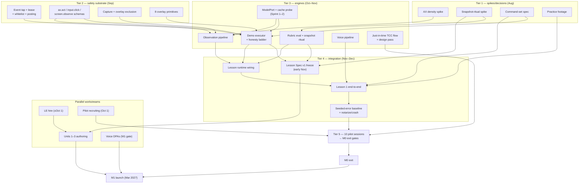

# The Live AI Tutor — Delivery Plan v1

**Status:** Execution-ready engineering delivery plan. This document sits **beneath** `execution-plan.md` (the strategic plan) and the constitution (`notes/constitution.md`): it converts settled decisions into decomposition, dependencies, phases, gates, and tasks. It re-litigates nothing; where the strategic plan states a number, this plan repeats it verbatim and adds the engineering beneath it.

**Provenance:** Drafted 2026-08-03 from a three-agent grounding pass (strategy corpus, design memos, live code audit at `main` = `770b48a` — `make check` green: 16 protocol tests, 27 core tests, 8 Swift tests), five parallel specialist planning drafts, and three adversarial reviews (fidelity, sequencing, production pragmatism — 35 findings, one blocker). Every finding is resolved in the text; the material resolutions are recorded in Appendix A so nobody re-discovers the contradictions later.

**Reality anchor:** Today is 2026-08-03. The repo already contains working skeletons — IPC protocol v0.1.0 with cross-language golden-fixture tests, the session state machine + hash-chained journal, IPC client/server with token auth and semver negotiation, Lesson Spec v0 parser, overlay spotlight, AX bridge (spike-only), a possession gate that is real but unwired, and the two week-1 spike binaries (`AXProbe`, `SnapshotSpike`). Formal build start is ~1 Sep 2026 with 2.5–3 engineers + the founder (FCP domain expert) + a learning engineer to hire. **August is found time and is founder-executable.** The plan starts from this code, not from zero.

---

## 1. Executive planning summary

**What we are delivering first:** M0 "the slice" — one Final Cut Pro lesson end-to-end on a stranger's Mac, exiting through the strategic plan's gates verbatim (§9), in the mid-Dec 2026 window with sanctioned slack to Jan 2027, inside ~37 engineer-weeks. Then M1 design partners (Mar 2027): Units 1–3 live, 100 founding partners in cohorts of 20–30, compliance workstream complete.

**The five planning calls that shape everything below:**

1. **Safety substrate before engines.** The constitution's mechanical guarantees (≤100 ms hardware interrupt, possession lease, whitelist, forbidden verbs, panic) are currently *claimed, not proven* — the event tap is an empty function, the possession gate is decorative, the posting path is commented out. No model-driven action ships before this chain is real and measured. It is Sprint 1, and it is the schedule's spine.
2. **Two freezes, not one.** Sep week 2 freezes only the **interfaces** two workstreams build against (IPC v0.2 schemas, Step IR shape, draft rubric grammar). The **Lesson Spec v1** freezes in early Nov, after the executor and rubric evaluator have defined what `verify:` and `rubric:` actually mean, with Lesson 1 as the co-evolution vehicle. Freezing the spec before the evaluator exists risks 21 lessons of rework; freezing interfaces late blocks parallelism. Both mistakes are avoided by naming two dates.
3. **Manual-first everywhere the gates allow.** M0 metrics come from journal exports + a checked-in analysis script, not a hosted dashboard. M0 seeded errors come from a Lesson-1-minimal scripted driver, not a general suite. Onboarding is concierge-attended. Billing is payment links + a spreadsheet ledger. A 4–4.5-person team automates only what the funnel data indicts.
4. **T0 (computer-use vision) is out of the M0 slice.** Lesson 1 is authored T2/T1 only; at M0 the honesty ladder's tier-drop rung from T1 resolves directly to *convert-to-learner-performed-step*. The minimal T0 executor lands when the first lesson needing a T0 rung is authored — no later than early M1.
5. **The founder is the scarcest resource.** Domain input (canonical actions, command set, Lesson 1) is front-loaded into Aug–Sep before GTM ramps in Oct; the learning-engineer hire (offer out by Aug 31, start ≤Oct 1) absorbs content execution; September content is explicitly founder-solo.

**The critical path:** spikes (Aug) → safety substrate (Sep) → demo executor (Oct) → lesson-runtime integration (Nov) → pilot logistics (late Nov–Dec) → M0 gates. Slack lives in: the Jan calendar buffer, the Figma bridge (built-in board covers M0), voice polish, and Units 2–3 authoring. Slack does **not** live in Tier 2 safety work — slippage there moves the whole chain day-for-day.

---

## 2. Product decomposition

### 2.1 Product areas → package map

The repo fixes the top-level shape: `protocol/` (IPC contract), `core/` (agent-core), `shell/` (OS organs), `docs/`, `spikes/`. The delivery plan builds inside that shape and adds homes only where none exists.

| Product area | Home today | State (code audit) | New homes needed |
|---|---|---|---|
| IPC contract | `protocol/` v0.1.0 | Envelope, 6 methods, 4 events, errors, negotiation, 5 golden fixtures — real | Schemas for the 7 reserved methods; fixtures per method |
| Session loop + journal | `core/src/session/` | FSM (9 phases, possession axis) + hash-chained journal — real, tested | — |
| Demonstration engine | `core/src/demo/` (types only); `shell/Sources/{EventTapGuard,AXBridge,Overlay}` | Vocabulary only; gate/poster sketched, tap not created | `core/src/demo/` executor + verifier + capability registry; `core/src/adapters/{fcp,figma}/` |
| Observation & assessment | `core/src/observation/` (types); `CapturePipeline` (empty) | Trigger enum + 80/hr constant only | `core/src/observation/` tape/budgeter/rubric; `core/src/assessment/`; AXObserver feed over IPC |
| Curriculum runtime | `core/src/curriculum/` | Spec v0 parser real; no runtime | Sequencer, hints, review scheduler; **`content/`** (new top level: lesson YAML, starter `.fcpbundle` assets, rubrics — versioned separately from engine) |
| Learner model | `core/src/learner/` | SQLite migration + mastery table (no production writer) | Mastery updater, affect/pace/lang fields, placement flow |
| ModelPort / AI | `core/src/model/` | Interface + throwing stub + tier constants; no SDK | Per-model request builders, cache layout, cost meter, `core/src/prompts/` |
| Voice | `core/src/voice/`; `shell/Sources/VoiceIO` | Interfaces / empty methods | Vendor clients in core; mic/playback in shell; `voice.say` method |
| Shell organs | `shell/Sources/*` | Overlay spotlight real; permissions query real; tap/capture stubs | Remaining 6 overlay primitives, tap creation, SCK pipeline, TCC watcher |
| QA / replay harness | none | — | **`qa/`**: lesson replay tests, seeded-error driver, FCP-version canary |
| Release engineering | `shell/Scripts/` (dev signing only) | No notarization, Sparkle, crash reporting | **`release/`**: notarization, DMG, Sparkle appcast, Sentry/MetricKit |
| Cloud services | none | — | **`backend/`** (M1): accounts, metered billing, API relay, telemetry ingest, learner-model sync |
| Ops dashboard | none | — | **`ops/`** (M1): the ten plan metrics. M0 uses a checked-in analysis script over journal exports — no backend at M0 |
| Website / waitlist / consent tooling | none | — | Off-repo or `web/`; M1 with the compliance workstream |

### 2.2 Core user journeys as engineering flows

**J1 — First-run + staged TCC (just-in-time, value-first — never an install-time ladder).** (1) Notarized DMG install; Gatekeeper-clean launch. (2) Shell starts, writes 0600 `ipc.json`; core connects, `session.hello`, semver negotiation (exists). (3) Permissions requested at the strategic plan's named moments, never bundled: **Microphone at first launch** ("talk with your tutor"); **Screen Recording before lesson one**, followed immediately by the tutor demonstrating value by narrating the learner's actual screen; **Accessibility right before the first demonstration**; **Input Monitoring before first observed practice**. Each ask: explain-why card → prompt → non-prompting verify → defined degraded mode on denial (voice-out-only; events-only observation; Guide-only teaching; no fluency detection). `Permissions.swift` must gain a TCC watcher (`permission.status` pushed) and report `denied` truthfully (audit drifts #7, #9). (4) Command-set install: FCP default + automation bindings on F13–F19/hyper keys; a customized learner set is detected and **asked about** before shadowing; installed version journaled; prior set restored on exit **and** crash. (5) macOS monthly Screen Recording re-approval pre-empted in the session-start ritual. (6) Whitelist + default blocklist primed. Funnel telemetry spans the whole first session (the four asks happen at different moments inside it). Gates verbatim: TCC onboarding completion ≥70% of attempters; *if the permission funnel converts <50%, stop and fix onboarding — up to concierge onboarding for the founding cohort — before building anything else.*

**J2 — Placement-by-doing.** Four observed micro-tasks in real FCP, ~8 min, no quiz: sequencer loads the placement spec → overlay caption states each task → observation tape + AX reads score it → mastery updater writes priors to `skill_mastery` → language observer seeds the code-switch ratio from learner speech. Output: initial per-node mastery, starting scaffold band.

**J3 — Full lesson session.** (1) *Contract:* core proposes the session contract (lesson id, bundle-ID whitelist, declared practice display, pre-screen disclosure with per-session decline); learner accepts; shell arms whitelist + `SCContentFilter` + blocklist; the tutor-created FCP library is opened — the learner's personal library is never the operating target. (2) *Board theory with the ask:* first time, the tutor asks aloud — "I can teach theory in your Figma, or on my own board — where should we set up?" — and persists the answer. Board IR renders via the Figma bridge iff installed ∧ handshake <5 s ∧ no opt-out; else built-in board. Telestration is always the built-in overlay. (3) *Verified demo (Watch, TUTOR possession):* possession requested and granted — badge flip, chime, 1 s grace; per step PLAN→TELEGRAPH(600–900 ms)→ACT(T2/T1 per registry, `CGEventPostToPid` only, every event tagged)→VERIFY(AX predicate first; ≤2 retries; at M0 a failed T1 retry converts to a learner-performed step — see §8 T0 row)→NARRATE(outcome only after verify). Honesty ladder: retry → drop tier → convert to learner-performed step → show reference image → defer and log. Watch admission: compound post-recovery success ≥95%; T0 never for fluency. (4) *Observed attempt (LEARNER possession):* tape from AXObserver + listen-only tap + adapter polls; Haiku pre-screen 1 frame/5 s (disclosed, declinable); six deep-look triggers through the 80/hr token bucket; default silence, 45 s struggle timer (floor 20 s), two unsolicited interruptions max — **immediate interruption reserved for destructive actions and compounding errors**. (5) *Snapshot ritual:* announced, possession-granted 2–4 s Export XML via the command-set/AX channel with focus restore, at attempt boundaries and debrief — never background polling. ≥99% reliability is an M0 exit gate. (6) *Artifact-graded debrief:* rubric evaluates FCPXML diff → fluency → verbal, in that order; mastery updates (artifact ±2.0 / fluency ±0.7 / verbal ±0.3, session cap ±3.0); scaffold/pace/language dials adjust; praise generated only from passing assertions; queued interruptions surfaced; review items scheduled (due-days 2/7/21).

**J4 — Crash/recovery.** Relaunch → shell reports frontmost + fresh AX snapshot → core replays journal to last verified postcondition → diff expected vs actual → in-character apology → resume or replan. **Never blind replay.** The learner's prior command set is restored even on crash (journaled). MetricKit + Sentry capture the crash itself. **Mid-session permission revocation follows the same abort path as hardware input:** any `permission.status` transition to revoked aborts the synthetic queue, marks the step FAILED, drops possession, then announces a degraded mode or re-grant prompt.

**J5 — Session end + log review.** Teardown of tap/observers/capture; command set deactivated via verified AX menu action; possession → IDLE; metered minutes closed; "What your tutor did" renders the hash-chained action log — every synthetic event (timestamp, app, AX path, lesson step, screenshot hash), every permission use, every deep look **including pre-screen frame counts**, every model-call summary and its cost. Export and delete available here.

### 2.3 The five engines (internal decomposition)

- **E1 Demonstration** (core + shell): lesson-DAG loader; capability registry `(bundle_id, verb) → tier`; T2 FCP adapter (command set + FCPXML import for prepared projects); T2 Figma adapter (dev plugin + localhost WS); T1 AX adapter over `ax.act`; step-lifecycle engine; verification-predicate evaluator; retry/tier-drop honesty ladder + failure taxonomy; shell-side enforcement (lease → `SyntheticKeyPoster`, frontmost + owning-app check before every post, forbidden-verb confirmation in every mode, pre-step snapshot/undo ledger); overlay choreography (8 primitives, eased cursor ~900 px/s, ≥350 ms travel). T0 executor: deferred per §8.
- **E2 Observation & assessment** (core + shell): event normalizer → semantic session tape (no pixels); AXObserver IPC feed (productionize the spike); listen-only tap feed with the frontmost-gate drop rule (non-whitelisted app ⇒ at most an activity boolean); SCK capture with overlay exclusion; Haiku pre-screen; six-trigger router + token-bucket budgeter (80/hr, audible degrade on exhaustion); rubric evaluator (event-grammar predicates + weighted FCPXML assertions + fluency thresholds + error signatures); artifact assessors (FCPXML v1.13 diff, Figma node tree, exported-file probes); mastery updater with decay/review queue.
- **E3 Curriculum runtime** (core + `content/`): spec loader with semver pinning; skill graph v1 (5 units / 21 lessons); sequencer; hint ladder mapped to scaffold levels (hard cap: one full demo per skill per session); remediation router; spaced-review scheduler; Board IR → dual renderers. Lesson Compiler v0 is M3.
- **E4 ModelPort & prompt/cache layer** (core): plain Anthropic TS SDK (never the Agent SDK); tier router (Opus 5 judgment / Sonnet 5 narration / Haiku 4.5 pre-screen); per-model request builders — frozen cached prefix (1 h TTL) with volatile state as mid-conversation system messages on Opus 5 and `<system-reminder>`-in-user-turn on Sonnet/Haiku; tool defs mirroring refusable IPC methods; per-request cost meter; cache-discipline CI (one buster ≈ 6× COGS); secrets per §12.
- **E5 Voice** (core + shell): cascaded STT→LLM→TTS; shell mic/playback + `voice.say`; Deepgram Nova-3 streaming with **`mip_opt_out` on every request from the first call ever made**; Cartesia Sonic TTS; narration plane decoupled from executor so barge-in (<300 ms) cancels TTS, never actions; continuers masking >1 s answers. Nepali path deferred (dual-gated, ≤4 EW cap, M2).

### 2.4 Data flows

| Data | Produced by | Transits vendors | Persists locally | Learner inspect/delete |
|---|---|---|---|---|
| Session journal | core FSM | Tape excerpts in prompts — semantic command events only, never raw keystrokes | Append-only SQLite | Log view; session purge |
| Action log (hash-chained) | shell | No | SQLite | "What your tutor did"; exportable |
| Deep-look frames | shell SCK | Anthropic (~7 d retention; up to 2 y if safety-flagged; no training) | **Never disk** — in-memory only | Counts + hashes logged |
| Haiku pre-screen frames | shell | Anthropic | Never disk | Disclosed everywhere; declinable per session |
| Voice audio | shell mic | Deepgram (no-training DPA = M1 gate); Sarvam (unverified — gates Nepali cohort) | No | Data map names each vendor |
| TTS text | core | Cartesia / Gemini (~55 d abuse logging) | No | In transcript |
| FCPXML snapshots | snapshot ritual | Assertion results/diffs may enter prompts; not the raw file by default | Lesson folder only | Learner's own files |
| Learner model | core | Synced at M1 (deletion must reach synced copies) | SQLite + JSON | Export + delete; employers see only attestations |
| Optional session recording | SCK | Only via the consent/redaction pipeline | Learner-owned local file | Fully learner-controlled |
| Distress/concerning content | observation | Never stored, never assessed | No | Neutral offer to stop only |
| Cost/telemetry counters | core meter | Own backend (M1); M0 = local export | SQLite | Per-session cost in log |

The per-vendor data map ships in-product; **never** absolute "nothing leaves the machine" copy anywhere.

### 2.5 Operations and support components

Concierge onboarding (founder-led screen-share); human-rescue channel (on-call human per pilot/design-partner session; every rescue logged — the numerator of the ≥80%-without-rescue M1 target); billing/refunds (payment links + spreadsheet ledger at M0/founding start; Stripe metered at M1); incident response (severity ladder: S1 = tutor acted outside whitelist or unconfirmed forbidden verb → immediate cohort-wide pause; S2 = data-handling deviation; S3 = reliability); consent/redaction pipeline (separate revocable agreement, mandatory redaction pass, review-before-publish, withdrawal window — never a checkbox); compliance ops per §4 of the strategic plan (M1 deadline); cohort ops (weekly feedback calls; published completion + median tutor-hours-to-capstone with required downward trend; monthly competitive-indicator review). **Vendor-outage policy (fixed):** on model-API failure beyond the retry budget, the tutor announces the outage, safe-stops, journals the session as vendor-terminated, and the metered time is auto-credited; "Anthropic outage / 529s" is a support runbook entry and a status check joins the session-start ritual.

---

## 3. Team and agent structure

Six roles fall out of the work; they map onto five seats. **This is the single staffing table — every other section defers to it.**

### 3.1 Roles

**R1 — Shell/Systems Engineer (Swift, macOS internals).** Owns everything below the model that touches the OS; the trust posture lives in this seat's code. Responsibilities: event tap + `PossessionGate → SyntheticKeyPoster → RPCHandlers` wiring; `CapturePipeline` (SCContentFilter, overlay exclusion); the 6 missing overlay primitives + cursor easing; just-in-time TCC flow with degraded modes + TCC watcher; voice I/O plumbing; snapshot-ritual shell side; signing, notarization, Sparkle, DMG. Receives IPC schemas (joint PRs with R2), verify-channel requirements from R3, onboarding/watchability specs from fractional design. Quality gate: hardware-interrupt p95 ≤100 ms on real hardware; overlay-exclusion CI green; `input.key` succeeds only under a held lease and aborts on focus change; notarized build passes the full TCC flow on a clean Mac.

**R2 — Agent-Core Engineer (TypeScript, model systems).** The teaching loop as code. Responsibilities: demo executor (full lifecycle, honesty ladder); verification evaluator; lesson-runtime wiring; rubric evaluator; mastery writes; replay harness (Rung 1) and the M0 metrics analysis script; drift-fix list; Lesson-1-minimal seeded-error driver. Quality gate: journal replay reconstructs state exactly; honesty ladder covered by fault-injection tests; narration never precedes a passed postcondition.

**R3 — Model/Voice/Cost Engineer (the 0.5–1.0 seat).** Responsibilities, **strictly sequential at 0.5 FTE**: ModelPort + SDK + cache-disciplined request builders + cache-discipline CI → observation budgeter + Haiku pre-screen → voice pipeline (**≥2 dedicated EW, landing before the Nov integration window**) → COGS metering → (Phase 5) the API relay. Quality gate: cache-discipline CI proves no builder touches the frozen prefix; measured cache-hit rate on every real session; voice budgets green on pilot-class hardware.

**R4 — Learning Engineer (the hire; offer out by Aug 31, start ≤Oct 1).** Pedagogy made machine-checkable: Units 1–3 Lesson Specs with the founder; rubrics in the shared event grammar; hint ladders, remediation, placement micro-tasks, review predicates; mastery calibration once corpora exist. Quality gate: every lesson replay-green on a clean machine; every rubric predicate machine-evaluable; authoring hours logged against the 20–30 h/lesson budget.

**R5 — Founder (domain expert, content lead, product owner).** Canonical FCP workflows and error catalogs into specs; **September content is founder-solo** (Lesson 1 draft + canonical-action list + command-set spec + practice footage); pilot recruitment and logistics; GTM groundwork; counsel through the §4 workstream; the raise around the slice; owner of the kill-criteria escalation path. Quality gate: 10 pilot sessions scheduled before week 12; compliance checklist complete by M1; DPAs signed before any learner audio hits a vendor.

**Fractional (buy, don't hire):** **Design (2–4 wks, engaged by Oct 1, runs Oct–Nov — decision E-7):** TCC onboarding flow + overlay watchability; gate: onboarding prototype user-tested on 2–3 non-pilot testers before the pilot cohort. **Counsel (from Oct 1):** consent instruments, DPA negotiation, GDPR stack, age gate, EU AI Act opinion — M1 deadline. **Security review (1–2 wks pre-M1):** adversarial review of tap, lease, whitelist, forbidden verbs, hash-chain audit. **Nepali voice evaluators (M2):** native-speaker panel, inside the ≤4 EW cap.

### 3.2 Seat mapping — honest version

| Seat | Holds | Load reality |
|---|---|---|
| Eng A (Swift) | R1 + the command-set/AX half of adapter work (with founder) | Overloaded weeks 1–5 (tap, posting, capture are serial on this seat). **Schedule-critical.** |
| Eng B (TS) | R2 + reliability harness + analysis script | Highest AI-agent leverage; critical-path owner from late Sep |
| Eng C (0.5–1.0) | R3 | Strictly sequential portfolio; ordering is a decision, not a preference |
| Learning engineer | R4 | Full; content is a critical path, not slack |
| Founder | R5 + product owner + vendor/counsel management | Structurally overloaded; pilot logistics and the raise collide in Nov–Dec — calendar planned explicitly |

**Deliberately unstaffed, with consequences:** dedicated QA (replay tests + seeded-error driver substitute; the final 2 EW integration/QA budget is not raidable); full-time designer (the fractional buy is mandatory — the ≥70% TCC gate hangs on it); DevOps/SRE (acceptable: local-first means ops ≈ release engineering, held by Eng A); Windows engineer (post-M3 by plan).

**Where AI coding agents change the math — and where they don't.** The committed skeleton is evidence: protocol mirrors, golden fixtures, and 51 passing tests are the shape of work agents do well. Plan on 1.5–2× for Eng B and all test/CI work (schema mirrors, fixtures, evaluators, CI jobs, drift fixes, linters, refactors). Plan on ≈1× for TCC behavior on real hardware, AX density empirics inside FCP, tap/SCK timing, voice latency tuning, notarization quirks — agents write the instrument but cannot shortcut the experiment — and for pilot logistics, DPA negotiation, hiring, watchability judgment. Net effect: **Eng A is the bottleneck**; never park that seat on scaffolding an agent could write.

### 3.3 Engineering ↔ content handoff (the Lesson Spec is the interface)

Contract artifacts: `core/src/curriculum/spec.ts` (engine pins major semver), a shared rubric event-grammar schema file, the spec linter, the replay harness. Flow: R5 drafts sequencing + canonical workflow → R4 authors spec + rubric → linter (local, synchronous) → engine replay on a clean machine → failures return as **typed diagnostics** (unknown intent verb, unverifiable predicate, missing tier binding) → R2 either extends the adapter/predicate library or bounces the spec with a reason. Change protocol: engineering may not break minor-version compat mid-unit; breaking changes batch at unit boundaries with a migration note and R4 sign-off; new intent verbs are engineering backlog items with a named owner *before* the lesson needing them is scheduled. Cadence: weekly spec review (R2 + R4); authoring-hours ledger reviewed against the 20–30 h budget.

---

## 4. Dependencies and sequencing

### 4.1 Ordered tiers

- **Tier 0 — committed and passing.** Everything in the reality anchor. Nothing below re-does any of it.
- **Tier 1 — spikes and pre-build decisions (Aug → Sep wk 1).** (a) AXObserver density spike (~20 canonical FCP actions); (b) snapshot-ritual spike; (c) command-set spec draft (founder — F13–F19/hyper bindings, install/activate/restore, customized-set detection); (d) practice-footage sourcing for Lesson 1 (founder — shoot or license redistributable media whose terms survive learner exports and public posting). The Anthropic cache probe and event-tap latency measurement are Sprint 1–2 work, not Phase 0 exits (§14).
- **Tier 2 — safety substrate (Sep).** Real CGEventTap; lease wired end-to-end; whitelist + forbidden-verb enforcement at the posting choke point; safe-stop/double-Esc; `possession.changed`/`hardware.interrupt` actually emitted; schemas for `ax.query`, `ax.act`, `input.click`, `screen.observe`, `voice.say`; `CapturePipeline` with overlay exclusion + CI assert; remaining 6 overlay primitives; the audit's drift fixes (cheap, and they harden the test harness every engine builds on).
- **Tier 3 — engines (Oct–Nov).** Demo executor; observation pipeline; assessment (rubric evaluator, FCPXML diff, production snapshot ritual, mastery writes); just-in-time TCC onboarding + degraded modes (with the fractional design pass, Oct–Nov); voice pipeline.
- **Tier 4 — integration (Nov–Dec).** Lesson-runtime wiring (parsed lesson drives the session machine — a connection that does not exist); **Lesson Spec v1 freeze (early Nov)**; Lesson 1 end-to-end on dev Macs; Lesson-1-minimal seeded-error driver + recorded catch-rate baseline; notarization + crash reporting; cache-discipline CI live; staged TCC flow validated on the fall macOS release (by ~mid-Nov).
- **Tier 5 — pilots (Dec).** 10 pilot sessions on non-developer Macs → the verbatim M0 exit gates.

**Content tier-mapping:** Sep = founder-solo (Lesson 1 draft, canonical actions, command set, footage). LE arrives ≤Oct 1, takes Units 2–3 in **draft format**, spec-and-assets-first; a scheduled migration pass lands at the early-Nov Spec v1 freeze; replay tests attach as the engine lands. **Compliance tier-mapping:** `mip_opt_out` from the first Deepgram request ever (Tier 3, day one of voice work); DPA negotiation opens Oct; consent regime/age gate/data map drafting runs from Oct with the M1 deadline. **GTM tier-mapping:** community groundwork + pilot pipeline open **Oct 1**; 15+ scheduled candidates by ~Nov 15; the YouTube consented-session series follows the consent regime + a demo worth recording.

### 4.2 Edge list ("X blocks Y because Z")

1. **AX density spike → observation-layer design freeze** — normalizer schema and look budget depend on whether AXObserver is dense (≥17/20 actions usable ⇒ observer-primary) or the hit-testing fallback is primary; if sparse, the look budget is re-derived and re-priced before M1.
2. **Snapshot-ritual spike → assessment engine contract** — if the 2–4 s ritual can't hit T2-grade reliability, artifact assertions are redesigned before the rubric grammar freezes (≥99% is an M0 gate).
3. **Snapshot-ritual spike → Lesson Spec v1 rubric section** — authors write artifact assertions against what the ritual actually delivers.
4. **Command-set spec → T2 adapter + demo executor + Lesson 1 authoring** — every T2 keystroke step and its focused-pane precondition binds to it.
5. **SDK wiring + live cache probe → all request builders** — the per-model volatile-injection split must be verified against the live API before builders are written, or the cache-discipline CI asserts the wrong thing.
6. **Event tap + possession lease → any synthetic posting** — no `ax.act`/`input.*` handler ships before the gate is consulted.
7. **`ax.act`/`input.click`/`screen.observe` schemas → demo executor and observation pipeline** — both engines are IPC consumers.
8. **CapturePipeline + overlay-exclusion CI → any vision verify or deep look** — captured frames must provably contain no overlay pixels before screenshots feed models.
9. **Overlay primitives → executor TELEGRAPH/NARRATE** — "nothing touched that wasn't first highlighted" needs spotlight/arrow/caption/cursor-ghost/pulse; only spotlight exists.
10. **Demo executor + rubric evaluator → Lesson Spec v1 freeze** — `verify:` and `rubric:` are opaque records until an evaluator defines their semantics. **The freeze is early Nov, not September.**
11. **Lesson Spec v1 freeze → Units 1–3 at scale** — Lesson 1 is the co-evolution vehicle; Units 2–3 draft-format authoring migrates at the freeze.
12. **Learning-engineer hire → Units 2–3 velocity** — the founder alone carries Lesson 1; 350–550 course hours need the pair.
13. **Fractional design pass → staged TCC onboarding → pilots** — the ≥70% gate hangs on a user-tested flow.
14. **Notarized build → pilot sessions** — stranger's Mac means Developer ID + notarization. (Sparkle does **not** gate pilots — concierge-attended; it is a hard requirement before M1 cohort wave 1.)
15. **Pilot recruiting (Oct 1 start) → M0 exit** — 10 sessions on strangers' Macs; 4–6-week lead time puts humans on the critical path.
16. **Recording-consent regime → YouTube series** — review-before-publish with mandatory redaction precedes the first public session video.
17. **Voice-vendor no-training DPAs → M1 launch** — a stated launch gate; negotiation opens Oct because DPA cycles run weeks-to-months.
18. **M0 demo → seed raise → M1 runway** — the demo is the pitch; the raise gates M1 scale, not M0.

### 4.3 Critical path to M0

1. **Now → early Sep — the two spikes (founder-executable found time).** Driving item: the AX density spike — its result freezes the observation design; if negative, fallback build-out enters the Tier 2/3 budget. The snapshot spike runs the same weeks on the same FCP install.
2. **Sep wks 1–3 — safety substrate.** Driving item: event tap + lease wired to a real posting path (~2 EW, zero parallelism within itself). The IPC action-method schemas land the same window so Tier 3 consumers aren't blocked.
3. **Late Sep → end Oct — demo executor.** The largest single engine (4 EW), consuming the AX bridge over IPC, the overlay primitives, and the command-set adapter. Observation and assessment run beside it on other seats; the executor finishes last and gates lesson-runtime wiring.
4. **Nov — Spec v1 freeze + lesson runtime + Lesson 1 integration.** Where curriculum format, executor, observation, and voice first meet; expect the integration surprises here — the 2 EW integration/QA budget sits immediately after and is not raidable.
5. **Late Nov → mid-Dec — hardening + pilots.** The driving item flips to non-engineering: pilot logistics. Notarized build, user-tested TCC flow, and the seeded-error baseline must be done by ~Nov 30 so 10 sessions fit before mid-Dec. Recruiting started Oct 1; scheduling 10 strangers takes calendar weeks no engineer can compress.
6. **Mid-Dec — M0 exit gates** (verbatim in §9), with the <50% permission-funnel stop-rule.

**Where the slack is:** the Jan 2027 buffer (~4 weeks — the sanctioned slip); the Figma bridge (2 EW — M0's board runs on the built-in board; the bridge can slip past M0 entirely); voice polish (the cascade and barge-in must work; tuning and all Nepali work are off the M0 path by rule); Units 2–3 authoring (M0 needs Lesson 1); observation cost tuning (the $8/hr gate must be verified, but the biggest dial — screenshot cadence — turns late). **Not slack:** Tier 2. Safety-substrate slippage moves the whole chain day-for-day.

### 4.4 Parallel tracks (owners per §3.2 — tracks are parallel only where seats differ)

- **Track 1 — Shell organs (Eng A):** tap/possession/posting → capture + overlay primitives → AX feed over IPC → TCC flow → notarization. Serial within itself.
- **Track 2 — Core engines (Eng B):** IPC schemas (with A) → demo executor → lesson-runtime wiring → analysis script + seeded-error driver. Critical-path owner from late Sep.
- **Track 3 — Model/voice/cost (Eng C):** ModelPort + cache CI → budgeter + pre-screen → voice (≥2 EW, before Nov) → COGS metering. Strictly sequential at 0.5 FTE.
- **Track 4 — Content (Founder; + LE from Oct):** Aug–Sep founder-solo (canonical actions, command set, footage, Lesson 1 draft) → LE takes Units 2–3 draft-format → migration pass at the Spec v1 freeze → replay tests as the engine lands.
- **Track 5 — Compliance + GTM (Founder + counsel + fractional design):** counsel and designer engaged by Oct 1; DPA negotiations; consent regime; community groundwork + pilot pipeline from Oct 1.

**Named collisions:** (1) The founder holds Tracks 4 and 5 — mitigated by front-loading domain input into Aug–Sep and the LE absorbing content from Oct; if the hire slips, Track 4 eats Track 5 and pilot recruiting slips — watched weekly. (2) A↔B share the IPC boundary — mitigated by fixtures-first discipline: schema + golden fixtures land in `protocol/` before either side implements. (3) Eng C at 0.5 cannot run voice and cache CI concurrently — the ordering above is the decision.

### 4.5 Decision-before-implementation

| Spike / decision | Must land before | Rationale |
|---|---|---|
| AX density spike result (≥17/20 threshold) | Observation design freeze; look-budget pricing | Sparse coverage makes hit-testing primary and reprices the look budget before M1 |
| Snapshot-ritual spike result | Assessment contract; rubric grammar; Spec v1 `rubric` section | A failed 2–4 s budget forces redesign before authors write assertions |
| Command-set spec (E-4) | T2 adapter, executor keystroke steps, Lesson 1, onboarding install/restore | Every T2 step binds to it |
| Live-API cache probe | All per-model request builders + cache-discipline CI | One cache-buster ≈ 6× COGS; the volatile-injection split must be fact, not doc |
| English voice-vendor validation (Deepgram terms incl. `mip_opt_out`; Cartesia latency) | VoicePort implementation | Vendor swap after integration is wasted EW |
| Watch-gate math (≥95% post-recovery compound) encoded as a library | Executor's demo-mode selection | The gate formula must be code before Watch demos are offered |
| API-key custody (E-1) | ModelPort transport design | Retrofitting custody is expensive |

**Safe to build regardless of every spike outcome:** all of Tier 2 (constitution-mandated invariants under any observation design); the just-in-time TCC flow; journal/learner-DB extensions; hint-ladder and scaffolding-fade runtime; fake-shell hardening + drift fixes; notarization/crash reporting; ModelPort streaming/retry plumbing; the AX hit-testing fallback (the design memo says build it now regardless); Board IR on the built-in canvas.

### 4.6 External dependencies and where each bites

- **Anthropic API/terms.** Bites Sep wk 1–2: model IDs in `tiers.ts` are unvalidated and no SDK dependency exists — first Track 3 task. Bites Aug 31: Sonnet 5 intro pricing expires; all COGS math uses standard $3/$15. Bites Dec: the COGS gate depends on 1 h-TTL cache pricing holding. Bites M1: retention terms go in the data map verbatim; zero-data-retention stays roadmap, never claimed fact.
- **Voice vendors.** `mip_opt_out` from the first Deepgram request ever (~Oct). Signed no-training DPAs are an M1 launch gate; negotiation opens Oct (founder/counsel time). COGS carries the non-discounted STT rate. Sarvam bites only the Nepali cohort (post-M2).
- **Apple.** The fall macOS release (~Sep–Oct) can shift AX/SCK/TCC behavior: **record each pilot's macOS version at screening; re-run both spikes within two weeks of GM; "staged TCC flow validated on the new macOS release" is a Tier 4 checklist item (~mid-Nov).** FCP point releases can move the command set or AX tree: version-pin the installed set; at M0 the founder re-runs the two spikes manually after any FCP update (the automated canary is M1). Notarization must be exercised before pilots. WWDC platform risk is a June 2027 watch item.
- **Figma plugin platform.** Zero M0 critical-path exposure by construction; a localhost-bridge policy change demotes the blackboard to fallback — re-verify the handshake before M1 polish, nothing more.
- **Pilot recruiting.** External humans inside the M0 gates: groundwork Oct 1; 15+ scheduled candidates by Nov 15 for 10 completed sessions; candidates need FCP installed (the Creator Studio 1-month trial makes this cheap).
- **Learning-engineer hire.** Offer out by Aug 31; start ≤Oct 1. Lesson 1 survives founder-only; Units 2–3 (an M1 gate) do not — each month of slip pushes M1 content readiness roughly month-for-month.
- **Seed raise.** Gates M1 runway, not M0. The notarized, pilot-proven build is also the fundraising asset — another reason Tier 4 release hardening cannot slide into the Jan buffer.

---

## 5. Phase-by-phase roadmap

Calendar: ~37 EW maps onto ~15–16 calendar weeks at 2.5–3 engineers, Sep → mid-Dec 2026, slack to Jan 2027. M1 targets Mar 2027.

### Phase 0 — Discovery (Aug found time → Sep wk 1)

**Objective:** retire the two questions that could invalidate the architecture before headcount burns on it. **Founder-executable** — no engineer is assumed on payroll in August.

**Outputs:** (a) **AXObserver density spike** vs real FCP across ~20 canonical editing actions (founder authors the list — domain work). **Pass threshold: ≥17/20 actions emit usable AXObserver notifications ⇒ observer-primary; below that ⇒ the hit-testing fallback becomes the primary channel, is scheduled into Sprints 1–2, and the look-budget re-derivation ticket opens with an M1 deadline.** (b) **Snapshot-ritual spike**: Export XML end-to-end with focus restore. **Pass: 50 consecutive scripted invocations, 0 failures, p95 within the 2–4 s window, replicated on a second Mac before the review** (a miss produces a written gap analysis feeding the ≥99% M0 gate plan). Plus: CI activated (repo pushed to a remote — the workflow has never run); command-set spec draft (E-4 groundwork); Lesson 1 practice footage shot or licensed with redistribution terms that survive learner exports and public posting; decisions E-2/E-3 executed.

**Exit criteria:** both spike reports in `docs/notes/` with raw numbers; pass or fallback-activated-and-recosted; CI green on the remote. The event-tap latency, cache-probe, and voice round-trip measurements are **Sprint 1–2 deliverables of their owning tracks, not Phase 0 exits** — August has no staff to run them.
**Biggest risk:** AXObserver coverage sparse *and* hit-testing expensive — reprices observation COGS; must be known before the design freeze.
**Review point:** founder + first engineer review spike reports end of Sep wk 1; a failed (b) blocks the assessment contract.

### Phase 1 — Interface freeze (Sep wk 2)

**Objective:** freeze every interface two workstreams build against — **and only those**. The Lesson Spec v1 freeze is *not* here (it is Tier 4, early Nov, after the evaluator defines its semantics).

**Outputs:** IPC protocol v0.2 — real schemas for `screen.observe`, `ax.query`, `ax.act`, `input.click`, `voice.say`, `board.draw`, `lesson.checkpoint`; golden fixtures extended; audit drift items closed (4401 close codes in the Swift server, hello-first auth enforced identically in both shells, fake shell emits `possession.changed`/`hardware.interrupt`, TTL default semantics defined, connection-replacement rule fixed). Frozen: Step IR shape, journal event taxonomy, capability-registry shape, command-set spec (founder-confirmed), **draft** rubric grammar (walked through the evaluator design on paper against Lesson 1's rubric). Cache-discipline and overlay-exclusion CI jobs specced. IPC schema-evolution rules written (one page: how reserved methods gain schemas, when negotiation majors bump, fixture-update protocol).

**Exit criteria:** all schemas merged with fixtures decoding green in both TS and Swift suites.
**Biggest risk:** freezing the draft rubric grammar too rigidly — mitigated by labeling it draft and scheduling its true freeze with Spec v1.
**Review point:** eng lead signs the schema set; founder confirms the command-set spec against real editor workflows. (The LE countersigns the Lesson Spec + rubric grammar **on arrival ≤Oct 1**, ahead of the early-Nov freeze — not here.)

### Phase 2 — Foundation (Sep wk 2 → end Oct, ~7 weeks)

**Objective:** every shell organ real and IPC-reachable; ModelPort live with cache discipline; the safety invariants enforced in code, not comments.

**Outputs:** event-tap guard wired end-to-end (tap created; `PossessionGate` consulted by `RPCHandlers`; `CGEventPostToPid`-only posting; frontmost + owning-app whitelist check before every post; non-whitelist keystroke drop at the tap callback; forbidden-verb confirmation; double-Esc panic; safe-stop with modifier release and drag mouse-up + step FAILED). Overlay: all 8 primitives, cursor easing, telegraph timing. Capture: real `SCContentFilter` with overlay + blocklist exclusion, per-display binding, in-memory frames. Permissions: just-in-time TCC flow with degraded modes, TCC watcher, truthful `denied`; **mid-session revocation wired to the hardware-interrupt abort path**. AX bridge over IPC with the observer feed normalizing into the session tape. ModelPort: live SDK, cache probe done, request builders with frozen-prefix discipline, streaming, retries, per-request cost metering; cache-discipline CI live. Voice plumbing: mic capture, playback, cancellable TTS. Both CI jobs from Phase 1 running. Content: founder-solo Lesson 1 draft complete; LE onboards (≤Oct 1) and starts Units 2–3 draft-format.

**Exit criteria (measured, not asserted):** hardware-interrupt p95 ≤100 ms in the harness; whitelist refusal and panic paths under automated test; overlay-exclusion CI green; cache-discipline CI green; a scripted 5-step T2/T1 sequence runs the full step lifecycle on a dev Mac against real FCP.
**Biggest risk:** the safety chain has zero automated coverage today; landing it late means everything downstream inherits untested safety.
**Review point:** eng lead reviews safety-harness results; founder runs a hands-on adversarial session (grab the mouse mid-demo, double-Esc mid-drag) before the phase closes.

### Phase 3 — Vertical slice (Nov, ~4 weeks)

**Objective:** FCP Lesson 1 end-to-end on developer Macs — the whole M0 session shape, driven by the lesson spec, not hardcoded.

**Outputs:** demonstration engine (executor, honesty ladder, verification evaluator, capability registry, Watch-gate computation over post-recovery success); observation engine (six triggers, 80/hr bucket, Haiku pre-screen with disclosure + decline, rubric evaluation, production mastery writes); curriculum runtime (lesson → session-machine binding, hint ladder, remediation, built-in board; Figma bridge only if slack permits); voice loop integrated (barge-in cancels TTS, never the executor); snapshot ritual productionized; per-session COGS ledger; action log surfaced in-app; **Lesson Spec v1 frozen (early Nov)** with the Units 2–3 migration pass scheduled; fractional design pass on the TCC flow + watchability, user-tested on 2–3 non-pilot testers.

**Exit criteria:** 20 consecutive clean-room runs of Lesson 1 (fresh FCP library, scripted learner) with scripted demo step-success ≥97%, snapshot ritual 100%, zero whitelist or possession violations in the hash-chained log; one full session trace showing cached-read pricing and measured COGS; **minimal induced-crash test green — `kill -9` mid-demo → relaunch → journal replay to last verified postcondition → fresh-AX re-ground → command set restored → correct resume, on ≥3 consecutive induced crashes** (the 10/10 battery is Phase 5's hardening bar).
**Biggest risk:** the verify-predicate evaluator meeting T1 ≥97% against real FCP AX-tree variance; the honesty ladder must absorb the misses without ever narrating unverified success.
**Review point:** whole-team slice review — eng lead walks one run's journal event-by-event; founder judges watchability (a 12-step demo lands in the 2–4 min band) and pedagogy; LE validates rubric grading against a deliberately flawed attempt.

### Phase 4 — Validation (Dec wks 1–3; slack into Jan 2027) — **M0 gate**

**Objective:** the slice on stranger Macs — 10 pilot sessions with non-developer learners on their own machines, instrumented end-to-end.

**Outputs:** notarized DMG (**notarization gates pilots; Sparkle does not** — pilots are concierge-attended; minimal Sparkle is M0-optional and a hard requirement before M1 wave 1); pilot protocol (recruiting, consent instruments from counsel, observation notes); per-session metrics bundles: per-step demo success by tier, snapshot reliability, TCC funnel per stage, interrupt p95, deep-looks + $/hour, COGS/hour — computed by the checked-in analysis script over journal exports (no hosted dashboard at M0).

**Exit criteria — the M0 gates, verbatim:** "scripted demo step-success ≥97% across 10 pilot sessions on non-developer Macs; snapshot automation ≥99% reliable; TCC onboarding completion ≥70% of attempters; session COGS ≤$8/hour verified; ≥7 of 10 pilot learners say they'd book another session. *If the permission funnel converts <50%, stop and fix onboarding — up to concierge onboarding for the founding cohort — before building anything else.*" Measurement: step success from journal VERIFY outcomes pooled; snapshot reliability across pilot invocations + the nightly harness (≥300 total, resolution below 1%); TCC completion from funnel telemetry over everyone who starts the flow; COGS from the ledger reconciled against vendor billing; the booking question asked verbatim in the exit interview.
**Biggest risk:** heterogeneous stranger hardware (FCP versions, displays, customized command sets); mitigated by command-set detection/restore, the pre-session compatibility check, and per-pilot macOS version recorded at screening.
**Review point:** M0 exit review — full team over the pooled metrics and all 10 journals. This gate is also the fundraise demo. A miss consumes the Jan slack before anything else is scheduled; the <50% stop-rule executes as written, without debate.

### Phase 5 — Hardening (Jan → Feb 2027)

**Objective:** convert a passed slice into a product 100 strangers can run unsupervised; complete everything the M1 gates require.

**Outputs:** pilot-findings burn-down; Sparkle 2 (two channels) + MetricKit/Sentry live; crash recovery hardened (10/10 induced-kill battery); **full seeded-error QA suite** (multi-lesson; duty-of-care checks wired and tested); **hosted metrics dashboard** (all ten plan metrics; ingest + Grafana/Metabase lands with `backend/`); **the API relay** (~1.5 EW, Eng C — short-lived scoped tokens, central metering; M1 billing sits on it); **unmetered out-of-session Q&A chat surface** (part of the priced offer — minimal v1: text chat with the lesson-pack cached context, no session machinery); Stripe metered billing; compliance workstream closed (signed voice DPAs, recording-consent regime, age gate, published data map); Units 1–3 replay-tested on clean machines; **the last 1–2 founding cohorts routed through the self-serve TCC flow with concierge backstop** so self-serve funnel telemetry exists before M2 open enrollment; weekly alpha dogfood.

**Exit criteria:** zero P0/P1 open; crash recovery 10/10; seeded-error catch-rate baseline on the dashboard; all Units 1–3 lessons replay-green; every M1 compliance item evidenced (signed DPAs on file, consent flows shipped); relay carrying real sessions.
**Biggest risk:** compliance long-poles (DPA negotiation, counsel opinions) — started in Phase 2/Oct precisely so hardening only *closes* them.
**Review point:** launch-readiness review — eng lead (reliability evidence), LE (all 9 lessons piloted at least once), founder (compliance checklist sign-off).

### Phase 6 — Release (Mar 2027) — **M1 design partners**

**Objective:** 100 founding partners in cohorts of 20–30 at $39/4 h; Units 1–3 live; remaining units shipping through the period; weekly feedback calls.

**Exit criteria (M1 targets by commercial month 2, verbatim):** ≥80% of sessions complete without human rescue; COGS ≤$8/hour holding; assist-per-task slopes negative for early cohorts.
**Biggest risk:** reliability at cohort scale differing from pilot scale (10 → 100 machines); mitigated by one wave live at a time until ≥80% no-rescue holds two consecutive weeks.
**Review point:** weekly cohort review over the dashboard; monthly competitive-indicator review. The kill-criteria clock starts: unassisted completion <60% at commercial month 4 after two architecture iterations **escalates to the constitution's owner** — this plan cannot authorize a guided-only product.

---

## 6. Milestones and quality gates (acceptance logic)

Format per deliverable: **Done** · **Quality** (how checked) · **Stability** (verified over time) · **Unblocks** (evidence required before dependent work proceeds).

**IPC protocol.** Done: v0.2 schemas for all reserved methods + all four events; both shells enforce hello-first auth and 4401 identically; fake shell emits the safety-critical events. Quality: extended golden fixtures decoded by both suites every commit; behavioral-parity checklist run against fake and real shells (auth window, TTL defaults, refusal codes). Stability: fixtures frozen per protocol version; negotiation tested against N−1; any schema change requires a fixture change in the same PR (CI-enforced). Unblocks: engines build on a method only after its fixture decodes in both languages and the real shell produces its typed refusal path.

**Overlay.** Done: all 8 primitives; cursor eased ~900 px/s, ≥350 ms minimum travel; telegraph 600–900 ms; badge never hidden. Quality: visual harness with screenshot assertions per primitive; a journal-ordering assertion that TELEGRAPH precedes ACT for every step — the "nothing touched that wasn't first highlighted" invariant, machine-checked. Stability: overlay-exclusion CI every commit; 60-min soak for leaks. Unblocks: executor integration requires the ordering assertion and pixel-exclusion CI green.

**AX bridge.** Done: `ax.query`/`ax.act` over IPC; observer feed normalized into the tape; hit-testing fallback live if the spike demanded it. Quality: per-canonical-action coverage table from the spike, re-run nightly against pinned FCP; T1 verify-channel reliability ≥97% over scripted runs. Stability: on any FCP release, the 20-action suite passes before sessions run on that version; version pin recorded per learner. Unblocks: verification evaluator and observation tape both consume this.

**Event-tap guard.** Done: real tap; lease consulted on every posting path; `CGEventPostToPid` only; pre-post whitelist check on frontmost AND owning app including during repair; focus-change aborts the in-flight queue; non-whitelist keystroke/click drop at the tap callback (at most an activity boolean survives); double-Esc panic; forbidden-verb confirmation in every mode; **permission revocation mid-session triggers the same abort path**. Quality: automated harness injecting HID-state events — interrupt p95 ≤100 ms over ≥1,000 events; safe-stop tests (modifiers released; interrupted drags post mouse-up and mark the step FAILED); whitelist violations produce typed refusal + safe-stop + log entry. Stability: interrupt p95 journaled per session; harness re-run per release. Unblocks: **no TUTOR-possessed action on any non-developer machine until p95, panic, and whitelist tests are all green** — the hard precondition for pilots.

**Capture pipeline.** Done: `SCContentFilter` excluding the shell's own windows and the default blocklist; per-display binding with rebind prompt; frames in-memory only; composited Set-of-Marks mode as a separate deliberate path (lands with T0, post-M0); deep looks suspended and announced under `IsSecureEventInputEnabled()`. Quality: overlay-exclusion CI; blocklist test (blocklisted app frontmost → no frame contains it); secure-input suspension test. Stability: monthly Screen Recording re-approval pre-empted in session start; pre-screen-cadence soak. Unblocks: the observation engine consumes frames only after pixel-exclusion CI exists.

**Permissions/TCC.** Done: just-in-time four-ask flow at the plan-named moments, each with a degraded mode; TCC watcher pushes `permission.status`; `denied` truthful. Quality: `make reset-tcc` matrix walkthrough (grant/deny each stage, **revoke each permission mid-demo**) scripted per macOS minor; per-stage funnel telemetry. Stability: funnel conversion tracked per cohort forever; macOS beta channel tested ahead of releases. Unblocks: pilot recruitment waits on the full matrix passing on ≥3 distinct Macs.

**Demonstration engine.** Done: full step lifecycle as code; ≤2 retries, second may drop a tier; complete honesty ladder with no silent skipping (at M0, T1's drop-tier rung resolves to convert-to-learner-performed-step — see §8); capability registry; Watch gate computed over post-recovery success ≥95% from **measured** per-step rates, never assumed targets; T0 constraints statically lintable from lesson specs (CI rejects a fluency-flagged step bound to T0). Quality: per-step success by tier instrumented against T2 ≥99.5% / T1 ≥97% / T0 ≥90%; seeded-failure tests exercising every ladder rung; assertion that narration never precedes a passed postcondition; the learner record distinguishes *demonstrated* from *described*. Stability: nightly Lesson 1 replay on the lab Mac with tier-success trend. Unblocks: pilots require 20 consecutive clean-room runs at ≥97% pooled.

**Observation/assessment.** Done: tape from AX events + tap + focus + adapter polls; six triggers exactly as specced; 80/hr token bucket; pre-screen disclosed, counted, declinable; degradation always announced; assessment order artifact → fluency → verbal; mastery writes with class weights ±2.0/±0.7/±0.3, cap ±3.0/session, 7-day-half-life decay. Quality: the seeded-error driver — planted mistakes; catch rate measured; budget test proving the bucket never exceeds 80 and the announced-degradation path fires; grader test proving **praise is structurally impossible when artifact assertions fail**. Stability: catch rate per release; deep-looks/hour and observation $/hour metered against the $3/hour ceiling. Unblocks: pilots require a recorded catch-rate baseline (from the Lesson-1-minimal driver) and the disclosure copy shipped.

**Curriculum runtime.** Done: parsed lesson drives the session machine; hint ladder with the one-full-demo-per-skill-per-session cap; remediation routing; spaced-review scheduler; Board IR on the built-in canvas with the Figma detected-upgrade and the ask-aloud-and-remember rule. Quality: the replay test (every shipped lesson end-to-end on a clean machine); schema CI; adaptation rules unit-tested against synthetic learner histories. Stability: replay re-run per engine release and per FCP update. Unblocks: Lesson 1 replay-green before pilots; every Unit 1–3 lesson replay-green before a cohort sees it.

**ModelPort.** Done: live SDK; tier routing; frozen cached prefix (1 h TTL) with per-model volatile injection verified against the live API; streaming, retries, per-request cost metering. Quality: cache-discipline CI asserting builders never touch the prefix and never emit mid-conversation `role:system` to Sonnet/Haiku; integration runs assert cache-read ratio from API usage fields. Stability: per-session cache-hit rate and $/hour tracked; alert when any session's LLM $/hour exceeds 2× the trailing median (the cache-buster signature). Unblocks: COGS gate measurement counts only after one full session trace shows cached-read pricing end-to-end.

**Voice loop.** Done: cascaded STT→LLM→TTS; p50 ≤1.0 s / p95 ≤1.5 s; **barge-in <300 ms hard**; continuers; `mip_opt_out` code-asserted in CI, not convention. Quality: latency harness replaying recorded utterances with per-stage timestamps; barge-in measured detect→silence. Stability: per-session latency percentiles journaled; vendor-outage degraded mode (text captions) tested. Unblocks: pilots require budgets green on pilot-class hardware over consumer networks; M1 requires signed no-training DPAs.

**Lesson content (Units 1–3).** Done: ≈9 lessons — specs, starter `.fcpbundle` assets **with redistribution-cleared media**, rubrics in the shared grammar, hints, remediation, review predicates; zero prompts, zero coordinates. Quality: schema CI; engine replay on a clean machine; rubric validation against paired seeded artifacts (one correct, one flawed — the grader must distinguish them); pedagogy sign-off by LE + founder. Stability: replay per release; rubric CI on FCPXML version bumps; authoring hours tracked against the 20–30 h → 12–15 h curve. Unblocks: Lesson 1 gates pilots; a lesson enters a cohort only replay-green plus one supervised live run.

**Onboarding funnel.** Done: instrumented end-to-end — install → just-in-time TCC asks at their session moments → command-set install (detection asks before shadowing; restore on exit and crash, journaled) → placement → first session. Quality: per-stage conversion telemetry; the TCC matrix per macOS version; command-set restore verified after induced crashes. Stability: funnel per cohort, weekly at M1. Unblocks: **TCC onboarding completion ≥70% of attempters** at M0; the <50% stop-rule executes before further feature work.

**Snapshot ritual.** Done: announced, possession-granted 2–4 s Export XML with focus restore at attempt boundaries; never background polling; the same journal-replay + fresh-AX machinery covers crash recovery. Quality: reliability per invocation; timing p95 ≤4 s; focus provably restored (AX-verified). Stability: nightly harness accumulating ≥300 invocations across ≥3 machines/FCP versions. Unblocks: artifact-graded assessment depends on it; M0 gate verbatim: **snapshot automation ≥99% reliable**.

**COGS instrumentation.** Done: per-session ledger metering every model call (tokens, cache reads/writes, tier), voice minutes, deep looks; $/tutor-hour computed and journaled. Quality: monthly reconciliation against vendor billing within ±10%; the M0 **session COGS ≤$8/hour verified** gate is measured from this ledger, not estimated. Stability: weekly trend at M1; cache-buster alert. Plan-anchored targets: ≤$8/h verified at M0 and holding at M1 (commercial month 2); ≤$6/h during the M3 B→C migration (~Q4 2027); kill-criterion 3 fires at >$12/tutor-hour at commercial month 6. Unblocks: exists before pilots.

**Trust surfaces.** Done: hash-chained action log surfaced as "What your tutor did" (every synthetic event, permission use, model-call summary, pre-screen frame counts); per-vendor data map published (M0: as a document handed to pilots; M1: in-product); zero-data-retention framed as roadmap, never claimed fact. Quality: `verifyChain` at session close and in CI; log-completeness test (a scripted session's every synthetic event and permission use must appear); copy-audit checklist against vendor terms. Stability: copy audit re-run on any vendor terms change; log format versioned with the journal schema. Unblocks: M0 requires "the full action log to show for it"; the data map ships before M1.

### Gate summary

| Gate | Threshold (verbatim where stated) | Measured by | When |
|---|---|---|---|
| Demo step success | ≥97% across 10 pilot sessions on non-developer Macs | Journal VERIFY outcomes, pooled | M0 exit |
| Snapshot automation | ≥99% reliable | Nightly harness + pilot invocations (≥300) | M0 exit |
| TCC completion | ≥70% of attempters (<50% → stop and fix) | Funnel telemetry | M0 exit |
| Session COGS | ≤$8/hour verified | Ledger vs vendor billing | M0 exit; holds at M1 |
| Learner intent | ≥7 of 10 would book another session | Verbatim exit-interview question | M0 exit |
| Hardware interrupt | p95 ≤100 ms | Injection harness + production journals | Phase 2 on, per release |
| Barge-in | <300 ms hard | Latency harness, detect→silence | Phase 3 on, per session |
| Watch-mode enable | ≥95% compound post-recovery success | Computed from measured per-step rates | Per segment, runtime |
| Tier instrumentation | T2 ≥99.5% / T1 ≥97% / T0 ≥90% | Per-step metrics by tier | Continuous |
| Deep-look budget | ≤80/hour; ≤$3/hour observation spend | Token bucket + ledger | Continuous |
| No-rescue sessions | ≥80% by M1 month 2 | Journals + support log | M1 |
| Unassisted completion | <60% at commercial month 4 → escalate to constitution's owner | Journals, after two architecture iterations | From M1 |

---

## 7. Risks, assumptions, and unknowns

Engineering-grade items one level beneath the strategic plan's §8 register (not repeated). Every item carries exactly one classification.

### 7.1 Must-resolve-before-build

| ID | Item | Why it blocks | Resolves |
|---|---|---|---|
| MR-1 | AXObserver density on FCP (~20 canonical actions; ≥17/20 threshold) | Determines observation architecture; sparse coverage makes hit-testing primary and reprices the look budget before M1 | Phase 0 spike (binary exists) |
| MR-2 | Snapshot ritual inside the 2–4 s budget with focus restore (50/0 on ≥2 Macs) | Assessment ground truth and the ≥99% gate; shapes executor design | Phase 0 spike (binary exists) |
| MR-3 | API-key custody on learner machines | Shapes ModelPort transport, metering, revocation, trust story; retrofit is expensive | Decision E-1, by Sep 15 — resolved posture in §12 Secrets |
| MR-4 | Learning-engineer hire | Content (350–550 h) is the M1 critical path; every unhired week slips Units 1–3 | Offer out by Aug 31; start ≤Oct 1; September is founder-solo content by plan |
| MR-5 | Repo has no git remote; CI has never run | Everything downstream assumes CI is a guard | Task 1, this week |
| MR-6 | Protocol-drift closure (4401; hello-first auth on both shells; fake shell emitting the safety events — the client paths are currently *unexercised*; `denied` mapping; `OVERLAY_TIMEOUT_MS`) | Engines must not build on a boundary the two sides disagree about | Phase 1 |
| MR-7 | FCP command-set spec (bindings, install, verified activate/deactivate, journaled restore on exit **and** crash, customized-set detection) | Blocks the T2 executor and crash-recovery correctness | E-4 by end of Sprint 1 |
| MR-8 | IPC schema-evolution rules (one page) | Unwritten, the drift list regrows every sprint | Phase 1 |
| MR-9 | Compliance sequencing: `mip_opt_out` from the first Deepgram call ever; EU AI Act counsel opinion before any EU learner; consent + age-gate artifacts | Legal exposure accrues from first use, not first launch | Flagged at voice start (~Oct); DPAs + opinions by M1 |
| MR-10 | Lesson 1 practice-media rights (footage must be redistributable and survive learner exports + public posting) | Starter assets, the YouTube series, and graduate reels all carry this media | Founder, Aug–Sep; LE per-unit thereafter |

### 7.2 Validate-during-implementation

| ID | Item | Validation method | When |
|---|---|---|---|
| VD-1 | ≤100 ms hardware-interrupt pause (no tap exists yet) | Instrumented harness, p95 on real hardware; permanent metric | Sprint 1; gates the first TUTOR-possessed demo |
| VD-2 | Tier targets T2 ≥99.5 / T1 ≥97 / T0 ≥90 (design targets, OSWorld-inferred) | Per-step instrumentation from first dogfood; Watch gate computed from **measured** rates | Continuous from wk 6 |
| VD-3 | Cache discipline (one buster ≈ 6× COGS) | Cache-discipline CI + metered cache-hit rate per session, alert on drop | CI lands with ModelPort, wks 3–5 |
| VD-4 | Overlay excluded from capture | CI asserting zero overlay pixels in captured frames | With CapturePipeline, wks 3–5 |
| VD-5 | Voice latency budget (p50 ≤1.0 s; barge-in <300 ms) | Per-stage timestamps per utterance; barge-in with a hardware loop | Voice integration, wks 8–11 |
| VD-6 | T0 action latency 2–6 s (estimate) | Measured when the T0 executor lands (post-M0) | With T0 work |
| VD-7 | FCP-version fragility of command set + AX tree | M0: founder re-runs spikes after any FCP update (manual); M1: automated canary on the lab Mac | Standing |
| VD-8 | Watchability dials (900 px/s, 600–900 ms telegraph, 2–4 min demos) | Pilot observation + the book-again question | M0 pilots |
| VD-9 | Seeded-error catch rate (viewer-canvas blindness; ≤90 s exposure), incl. duty-of-care cues | M0: Lesson-1-minimal driver, baseline recorded; M1: full suite, catch rate per release | Tier 4; Phase 5 |
| VD-10 | Notarized/hardened-runtime build retains AX control, event tap, SCK | Clean-Mac install through the full TCC flow | Packaging, wks 12–14; before every release |
| VD-11 | Mastery calibration (hand-tuned weights) | Predicted mastery vs subsequent artifact outcomes on the pilot corpus | Recalibrate at M1 |
| VD-12 | Sarvam quality + written data terms (dual gate) | Native-speaker panel + terms verified in writing | M2, before the Nepali cohort |
| VD-13 | Session-FSM granularity vs model improvisation | Count model actions fighting state boundaries in first lesson-driven sessions; adjust policy, not mechanism | Wks 6–8 |
| VD-14 | Monthly Screen Recording re-approval folded into session start | Exercised across macOS point releases on pilot machines | M0 pilots |

### 7.3 Proceed-on-assumption

| ID | Assumption | Tripwire that reopens it |
|---|---|---|
| PA-1 | Figma localhost-bridge pattern holds | Handshake failures >5% or any plugin-policy announcement → built-in board becomes the only board (no schedule impact by rule) |
| PA-2 | AX control, CGEvent posting, SCK remain permitted for notarized direct-distribution apps | WWDC 2027 / macOS beta notes → founder-level review within one week of any signal |
| PA-3 | B→C migration depends on capable local VLMs landing | No viable local watch model by commercial month 4 → re-forecast the COGS path against kill-criterion 3 before the month-6 measurement |
| PA-4 | Observation spend ≈$1.70/hr worst case, $3/hr ceiling | Any metered session >$3/hr → trigger-priority audit before the next cohort |
| PA-5 | 20–30 h/lesson early, falling to 12–15 with templates | Any of the first three lessons >30 logged hours → rescope M1 within Units 1–3 |
| PA-6 | Hand-tuned log-odds weights accepted-miscalibrated until corpora exist | VD-11 shows systematic divergence (praised skills failing artifact checks) → calibration sprint before M1 exit |
| PA-7 | Single-display v1 is acceptable | >20% of pilot applicants edit primarily dual-monitor → pull the fast-follow into M1 |
| PA-8 | `node:sqlite` + native undici WebSocket on Node 26 are production-stable for the journal path | Any journal corruption or socket flake in dogfood → swap to better-sqlite3 / ws (both behind existing interfaces) |
| PA-9 | Vendor data-map figures hold (Anthropic ~7 d; Google ~55 d; Deepgram opt-out + DPA) | Any terms change → data map, onboarding copy, and consent artifacts re-issued before the next session |
| PA-10 | 37 EW fits Sep→mid-Dec at 2.5–3 engineers with the AI-agent multiplier banked on the TS/CI side | Week-6 checkpoint (mid-Oct): >40% EW burned with <40% scope landed → invoke the Jan slack immediately and cut in this order: Figma bridge, overlay polish — **never** the tap, capture, executor, or snapshot ritual |
| PA-11 | Seed raise (~$1.5–2.5M) closes around the M0 slice | Any M0 gate red at week 12 → founder pitches on the partial slice + instrumented reliability data rather than sliding the raise into the Jan slack |

---

## 8. Scope ledger (in/out)

Statuses: **M0** (in the ~37 EW slice) · **M1** (design-partner launch) · **OPT** (if slack) · **DEF** (deferred; trigger named) · **MAN** (service-led/manual-first — done by hand before automating).

### Platform & protocol

| Component | Status | Notes / trigger |
|---|---|---|
| Protocol v0.2: schemas for all 7 reserved methods + fixtures | **M0** | Phase 1 |
| Drift-fix pass (12 audit items) | **M0** | Phase 1, with the spikes |
| CGEventTap + ≤100 ms interrupt + double-Esc + safe-stop | **M0** | p95 instrumented |
| Possession lease wired end-to-end; `CGEventPostToPid` only | **M0** | Replaces hard-coded refusal |
| Whitelist + frontmost-drop + blocklist + forbidden-verb confirmations | **M0** | Shell-enforced, below the model |
| Pre-step snapshot / undo ledger; dedicated session FCP library | **M0** | |
| SCK capture + overlay exclusion + single declared display | **M0** | |
| All 8 overlay primitives + cursor easing | **M0** | 6 to build |
| TCC watcher + just-in-time flow + degraded modes + mid-session revocation handling | **M0** | Gate ≥70% |
| Server-side timeouts, `SHELL_BUSY`, remaining refuse reasons | **M0** | Small; closes typed-but-never-produced gaps |
| Multi-display support | **DEF** | Trigger: ≥20% of pilots dual-monitor |
| `resumeSessionId` honored server-side | **OPT** | Journal replay is the real mechanism |
| Windows shell (UIA) | **DEF** | Post-M3 by plan |

### Engines

| Component | Status | Notes / trigger |
|---|---|---|
| Step IR + lifecycle executor + verifier + honesty ladder | **M0** | Watch gate ≥95% post-recovery compound |
| T2 FCP adapter (command set install/activate/restore, focused-pane preconditions) | **M0** | |
| T1 AX adapter over IPC | **M0** | Productionize `AXBridge` |
| Snapshot ritual automation | **M0** | Gate verbatim ≥99% |
| AX hit-testing fallback | **M0** | Built regardless of spike outcome |
| **T0 computer-use executor + Set-of-Marks + composited capture mode** | **DEF** | **Trigger: first lesson whose demo path requires a T0 rung — no later than early M1 authoring. At M0 the honesty ladder's tier-drop from T1 resolves to convert-to-learner-performed-step. Lesson 1 is authored T2/T1 only.** |
| Observation tape + six triggers + 80/hr budgeter + audible degrade | **M0** | ≤$3/hr observation spend |
| Haiku pre-screen + disclosure + per-session decline | **M0** | On-device migration is M3+ |
| Rubric evaluator + FCPXML diff + fluency scorer | **M0** | Lesson 1 thresholds MAN-tuned |
| Mastery updater + decay | **M0 (write path)** / **M1 (review scheduling live)** | |
| Scaffolding fade + assist score + interruption budget + struggle timer | **M0** | One full demo per skill per session, hard cap |
| Placement-by-doing | **M0** | |
| Board IR + built-in renderer + telestration | **M0** | No lesson blocks on a third-party board |
| Figma bridge + the spoken ask + persistence | **M0 (slack-permitting)** | First candidate cut under PA-10; built-in board covers M0 |
| Board-based retrieval checks graded via node tree/board state | **M1** | M0 ships verbal checks |
| ModelPort + SDK + cache-disciplined builders + cost meter | **M0** | COGS gate depends on it |
| Voice English (Deepgram `mip_opt_out` + Cartesia + barge-in) | **M0** | Apple SpeechAnalyzer floor **OPT** |
| Nepali voice path | **DEF** | Trigger: open-cohort gates green AND Sarvam data terms + quality pass (M2); ≤4 EW cap |
| Curriculum sequencer + hints + remediation | **M0 (single-lesson)** / **M1 (cross-lesson)** | |
| Unmetered out-of-session Q&A chat | **M1** | Part of the priced offer; minimal v1 in Phase 5 |
| Lesson Compiler v0; Resolve adapter; T1-only micro-course | **DEF** | M3 per plan |

### Content, QA, learner surfaces

| Component | Status | Notes / trigger |
|---|---|---|
| Lesson 1 (spec + cleared assets + rubric) | **M0** | Founder-solo Sep draft |
| Units 1–3 (≈9 lessons) | **M1** | Draft-format from LE arrival; migration at the early-Nov freeze |
| Units 4–5 + capstone | **M2** | Shipping through the M1 period |
| Hand-tuned rubrics/thresholds/weights | **MAN** | LE owns tuning; automate calibration post-M2 |
| Lesson QA replay | **MAN → M1** | M0: founder hand-runs on 2–3 non-dev Macs; automated harness for M1's 9 lessons |
| Seeded-error QA | **M0 (Lesson-1-minimal driver + recorded baseline)** / **M1 (full multi-lesson suite)** | Duty-of-care checks run at least once at M0 |
| "What your tutor did" log view | **M0** | |
| Learner data export/delete | **M0 (local)** / **M1 (reaches synced copies)** | |
| In-product data map | **M1** | M0: handed to pilots as a document (**MAN**) |

### Infrastructure & release

| Component | Status | Notes / trigger |
|---|---|---|
| Git remote + CI live + SwiftPM cache | **M0** (this week) | CI has never run |
| Cache-discipline CI; overlay-exclusion CI | **M0** | Plan obligations with no jobs today |
| FCP-version canary harness | **M1** | **MAN at M0:** founder re-runs spikes after FCP updates |
| Notarization + hardened runtime + DMG | **M0** | **Gates pilots** |
| Sparkle 2 appcast | **OPT at M0 / hard requirement before M1 wave 1** | Pilots are concierge-attended; rollout is manual |
| Crash reporting (MetricKit + Sentry) | **M0** | |
| Per-pilot scoped keys in Keychain (see §12 Secrets) | **M0** | No raw org keys in files on stranger machines |
| API relay (scoped tokens, central metering) | **M1** | Phase 5, ~1.5 EW, Eng C; M1 billing sits on it |
| Cost accounting | **M0: journal ledger + analysis script + spreadsheet reconciliation (MAN)** / **M1: hosted dashboard** | The gate is measured either way — instrumentation lives in the journal |
| `backend/` (accounts, Stripe metered billing, hour ledger, sync, telemetry ingest) | **M1** | M0: no accounts, no billing |
| Ops dashboard (ten plan metrics) | **M1** | M0 metrics from the checked-in script (**MAN**) |
| Second lab Mac mini | **M0** | One pinned to pilot-fleet FCP/macOS; one canary taking updates first |
| SOC 2 tooling | **DEF** | Commercial month 7, regardless |

### Operations & compliance

| Component | Status | Notes / trigger |
|---|---|---|
| Concierge onboarding | **MAN** | Default for pilots and early founding cohorts; last 1–2 founding cohorts run self-serve with backstop |
| Human-rescue channel | **MAN** | On-call human per session; every rescue logged against the ≥80% M1 target |
| Scheduling/cohort management | **MAN** | Calendly + spreadsheet through M1 |
| Billing & refunds | **MAN → M1** | Payment links + spreadsheet ledger; Stripe metered at M1 |
| Consent/redaction pipeline | **MAN** | Lawyer-drafted, separate, revocable; founder redacts by hand; never automated before M3 |
| Incident response | **MAN** | Written severity ladder + founder on-call; Sentry alerts only automation |
| Compliance workstream (DPAs, GDPR, Nepal 2075, age gate, EU counsel) | **M1 (hard deadline)** | Deepgram DPA and consent regime gate launch |
| Age gate | **MAN → M1** | Application review is human |
| Weekly feedback calls; published cohort metrics | **MAN** | Standing commitment |
| Competitive-response indicator review | **MAN** | Monthly |
| B2B attestation surface | **DEF** | Trigger: the strategic plan's pull-forward conditions |

---

## 9. MVP definition — M0 "the slice" as an engineering deliverable

**One complete FCP lesson (Lesson 1, Unit 1) delivered end-to-end by the tutor on a stranger's Mac** — a non-developer machine, installed from a notarized DMG — exiting through the gates verbatim: *"scripted demo step-success ≥97% across 10 pilot sessions on non-developer Macs; snapshot automation ≥99% reliable; TCC onboarding completion ≥70% of attempters; session COGS ≤$8/hour verified; ≥7 of 10 pilot learners say they'd book another session."*

**The session, precisely (each item a checkable subsystem):** (1) notarized install + just-in-time TCC asks at the plan-named moments, funnel instrumented per stage; (2) placement-by-doing (4 micro-tasks seeding `skill_mastery`); (3) board theory with the spoken ask (built-in board; Figma if the bridge made the cut); (4) live verified demo — T2/T1 scripted steps, full lifecycle, honesty ladder, all 8 overlay primitives, possession lease with ≤100 ms interrupt and double-Esc; (5) observed attempt — foveated observation, six triggers, 80/hr cap, pre-screen disclosed/declinable, 45 s struggle timer, two-interruption budget, **immediate interruption only for destructive actions and compounding errors**; (6) snapshot ritual at attempt boundaries (≥99%); (7) artifact-graded debrief with mastery updates and praise wired to passing assertions; (8) the hash-chained action log surfaced, with the session's COGS number on it.

**Explicit exclusions (deliberately absent at M0):** no accounts, payments, or metering UI (pilots are free, concierge-scheduled); no self-serve download page; no Windows, Resolve, or Keynote micro-course; no Nepali voice (English-only pipeline); no Lesson Compiler; no on-device model; no dual-display support; **no T0 anywhere in Lesson 1's demo path** (T2/T1 only; the ladder's tier-drop converts to a learner-performed step); no lessons beyond Lesson 1 running in-engine (Units 1–3 exist as drafts/specs); no marketplace, B2B, or SOC 2; no out-of-session chat (an M1 deliverable — part of the priced offer, not the M0 slice); Sparkle optional (manual, concierge-attended rollout).

---

## 10. First release plan — M1 design partners (target Mar 2027)

**Scope.** Units 1–3 live (≈9 lessons), remaining units shipping through the period; 100 founding partners in cohorts of 20–30 at $39/mo incl. 4 h; tutor-hours metering on the relay + Stripe billing; **unmetered out-of-session Q&A chat live** (the priced offer includes it); compliance complete per the strategic plan's §4. Targets by commercial month 2, verbatim: ≥80% of sessions complete without human rescue; COGS ≤$8/hour holding; assist-per-task slopes negative.

**Release engineering.** Developer ID Application cert (enrollment = decision E-2; the team ID choice is permanent for TCC-grant continuity); hardened-runtime entitlements replacing `dev.entitlements` (`get-task-allow` stripped); `notarytool` submit + staple in CI; DMG assembly extending `make-app.sh`. Sparkle 2: EdDSA-signed appcast, two channels — `internal` (dogfood, per-merge) and `cohort` (weekly); private key in CI secrets only. Versioning: app semver (build metadata = git SHA); IPC protocol semver negotiated independently (already implemented); lesson-pack semver with engine pinning majors (already enforced). A release = (app, protocol, lesson-pack) version tuple recorded in the journal at session start. Crash triage: MetricKit + Sentry, weekly rotation; any crash during TUTOR possession is a P0 with a 48 h fix-or-mitigate SLA (it exercises the RECOVERY path).

**Rollout mechanics.** Cohort waves of 20–30, one wave live at a time until ≥80% no-rescue holds two consecutive weeks. Concierge onboarding (30-min video call: install, TCC moments, command-set install with the customized-set ask, dedicated library setup, first placement) is the default posture for early cohorts; **the last 1–2 founding cohorts run the self-serve staged flow with concierge as backstop**, so self-serve funnel telemetry is green before M2 open enrollment is committed.

**Support.** Private Discord per cohort + support email; founder runs weekly feedback calls; in-session human-rescue button pages the on-call engineer; every rescue logged against the ≥80% gate; weekly support rotation owns Discord triage + the crash queue.

**Rollback / kill-switch.** Appcast keeps the previous version live; rollback = re-pointing the channel; Sparkle downgrade tested in CI before M1. Session kill-switch: a signed remote flag fetched at session start (fail-open to last-known-good; never blocks offline lessons already cached) that can (a) disable synthetic input posting globally — sessions degrade to Guide/Together, announced honestly, **as incident response only, never the product**; (b) revoke a lesson-pack version; (c) force a model-tier fallback. Every flip announced in-app; nothing degrades silently. Learner-side kill (double-Esc, badge stop) proven in the latency harness before any cohort session.

---

## 11. Validation strategy

1. **Unit + golden fixtures (exists — extend, don't rebuild).** 51 tests today, including the real-socket fake-shell integration suite and the cross-language fixture decode. Standing rule: **every new IPC method or event lands with a golden fixture decoded by both suites in the same PR.** The fake shell is the protocol reference implementation and must stay behavior-identical to `IPCServer.swift`; the audit's drift items are debt burned down in Phase 1.
2. **Lesson Spec replay tests — two rungs.** *Rung 1 (CI, every merge):* the executor replays a lesson's step DAG against a scripted-AX fake shell — deterministic responses, injected failures exercising retry/tier-drop/honesty-ladder — asserting the journal contains the full lifecycle per step. *Rung 2 (nightly, lab Mac):* full replay against real FCP on the pinned Mac mini, clean learner account, starter assets snapshot-restored; produces the per-step success-by-tier numbers feeding the ≥97% gate and (at M1) the FCP-update canary. No lesson ships to a cohort without a green Rung-2 run on the current FCP version.
3. **Seeded-error validation.** M0: the Lesson-1-minimal scripted bad-learner driver covers Lesson 1's error signatures (≥3 undos/30 s, menu wandering, oscillating values, one state-invisible wrong-but-plausible trim) and records the catch-rate baseline; duty-of-care cues (scripted despair phrases → acknowledgment + pause offer, never diagnosis) run at least once. M1: the full multi-lesson suite, weekly on the lab Mac; catch-rate regression blocks release.
4. **Possession/interrupt latency harness.** A driver process posts genuine HID-state events (or a $30 programmable USB dongle for true end-to-end) while the shell is mid-synthetic-sequence; measures tap-callback→gate-abort (<10 ms), input→pause (≤100 ms), double-Esc→STOPPED, drag-interrupt→mouse-up+FAILED, TTS truncation <300 ms once voice lands. p50/p95 emitted machine-readably; runs per merge touching `EventTapGuard`/`IPCServer`, full run nightly.
5. **Pilot-session protocol.** Recruiting: FCP.cafe, r/finalcutpro, film-school contacts; screen for non-developer Macs, macOS 15+, FCP installed; record macOS/FCP versions at screening. Consent: session-observation consent + the separate revocable recording consent, drafted with counsel before pilot 1. Instrumentation: every pilot produces a metrics bundle (TCC funnel per stage, per-step tier/success, deep-looks + $, interrupt latencies, snapshot timings, rescue events, journal export). Debrief: structured 15-min interview + the book-again question verbatim. Founder observes silently; rescues allowed and logged.
6. **Dogfooding.** From Sprint 2: every engineer runs one full session weekly as a learner on a non-dev macOS account (clean TCC state); founder teaches a real novice biweekly from October. Dogfood sessions feed the same metrics, tagged internal.
7. **Metrics.** M0: sessions export journal bundles; a **checked-in analysis script** computes the five exit-gate metrics; COGS reconciled against vendor billing in a spreadsheet. M1: opt-in count-level telemetry to a small ingest endpoint; Grafana/Metabase over Postgres serves the ten plan metrics (per-step success by tier; deep-looks/hour and $/hour; interrupt p95; catch rate; assist slope; tutor-hours-to-capstone; capstone/unassisted rate; week-4 retention; referral share; GM per tutor-hour).

---

## 12. Infrastructure and operational work

**CI matrix** (extend `.github/workflows/ci.yml`; activation is Task 1):

| Job | Runner | Content |
|---|---|---|
| ts | macos-15 | biome (fix the schema-version infos), `pnpm -r typecheck`, `pnpm -r test`, `make demo` |
| swift | macos-15 | `swift build` / `swift test` + SwiftPM cache |
| fixtures | macos-15 | Cross-language golden-fixture decode; fails if a method/event lacks a fixture |
| cache-discipline | macos-15 | Snapshot tests on per-model builders: prefix bytes identical across N turns; no mid-conversation `role:system` on Sonnet/Haiku |
| overlay-exclusion | lab Mac | Draw sentinel spotlight → `captureOnce` through SCContentFilter → assert zero sentinel pixels |
| latency / replay / seeded-error | lab Mac | §11 harnesses, nightly + on-touch |

**Lab hardware:** **two Mac minis** (Sep): one pinned to the pilot-fleet FCP/macOS version for replay/latency/seeded-error runs; one canary that takes FCP and macOS updates first. They are the only place capture, FCP, and latency tests can truthfully run.

**Release pipeline:** tag → CI green → `make-app.sh` (release config, hardened runtime) → notarytool → staple → DMG → EdDSA-sign → appcast → channel promotion (`internal` auto, `cohort` manual). Sparkle key and Developer ID cert in CI secrets only.

**Crash reporting:** Sentry (native + Node) + MetricKit; symbol upload in the pipeline; crash IDs cross-referenced to journal session IDs so RECOVERY behavior is auditable.

**Telemetry:** opt-in, count-level only, enumerated in the data map — session start/complete, phase durations, per-step tier + pass/fail (no content), deep-look counts + cost, interrupt latencies, funnel stages, rescue events. Never: keystroke content, screenshots, AX text, audio.

**COGS accounting:** ModelPort meters every request (model, tokens, cache read/write, computed cost); VoicePort meters STT minutes/TTS characters at non-discounted rates. Per-session total written to the journal and shown in the action log ("what your tutor did — and what it cost"). The $8/hour gate is read from this meter, not estimated.

**Secrets — the resolved posture (one story, used everywhere).** Dev: gitignored env file (status quo). **M0 pilots: no raw org keys on stranger machines — each pilot session runs on a per-pilot, workspace-scoped Anthropic key with a hard spend limit (~2× expected session COGS), created before and revoked immediately after the session during concierge setup; same pattern for Deepgram project keys; stored in Keychain, not env files; "key issued/revoked" is a session-runbook step.** M1: the relay (Phase 5, ~1.5 EW) issues short-lived scoped tokens and proxies model/voice calls with central metering; billing sits on it. CI: GitHub encrypted secrets. Log hash-chain anchor in Keychain.

**Learner-data lifecycle:** local-first SQLite per profile. Inspect: in-app action log (chain-verified) + one-click export of journal, learner model, and data map. Delete: profile wipe in-app; when sync exists (M1+), deletion propagates to synced models within 30 days; vendor-side data governed by the per-vendor map.

**Support ops:** weekly rotation owning Discord + crash queue + rescue pages; runbooks for the top failure classes (TCC wedge, FCP update broke the command set, Sparkle rollback, **Anthropic outage / 529s** — announce, safe-stop, journal as vendor-terminated, auto-credit the metered time); every rescue and runbook gap reviewed in the weekly retro.

---

## 13. Next decisions required from the founder

| # | Decision | Options | Recommendation | Decide by |
|---|---|---|---|---|
| E-1 | API-key custody | (a) relay before pilots; (b) per-learner keys, client metering; (c) scoped per-pilot keys at M0, relay at M1 | **(c) hardened**: per-pilot workspace-scoped spend-capped keys in Keychain, issued/revoked per session (§12); relay in Phase 5 on Eng C | 2026-09-15 |
| E-2 | Legal entity + Apple Developer Program enrollment | Enroll existing entity now vs wait for incorporation cleanup | Enroll now — team-ID migration before external installs is cheap, after is not; cert in hand by Oct 1 | 2026-09-01 |
| E-3 | Learning-engineer start + third engineer | LE Sep vs Oct start; 2.5→3 eng now vs post-raise | Offer out by **Aug 31**, start ≤Oct 1; September is founder-solo content; hold the third-engineer upgrade until the raise unless a strong candidate appears | 2026-08-31 |
| E-4 | Command-set key allocation | F13–F19 vs hyper chords; shadowing policy for customized sets | F13–F19 primary (no modifier-state interaction), hyper-chord fallback for >7 verbs; decide from August spike data | End of Sprint 1 (2026-09-12) |
| E-5 | Billing/metering provider | Stripe metered vs Paddle/LemonSqueezy MoR | Stripe — tutor-hours metering is load-bearing product logic | 2026-11-15 |
| E-6 | Pilot recruiting + counsel engagement | Community source; counsel timing | FCP.cafe + r/finalcutpro; **community groundwork from Oct 1, 15+ scheduled candidates by Nov 15**; counsel engaged by Oct 1 so consent documents exist before pilot 1 | 2026-10-01 |
| E-7 | Fractional design engagement | Which designer; scope (TCC flow + watchability) | Engage by Oct 1; 2–4 wks across Oct–Nov; onboarding prototype user-tested on 2–3 non-pilot testers before the pilot cohort | 2026-10-01 |
| E-8 | Practice-footage sourcing | Shoot own vs license | Founder shoots own footage for Lesson 1 in August (cleanest rights: must survive learner exports and public posting); license per-unit only if shooting doesn't scale | 2026-08-31 |

---

## 14. Recommended first sprint

**August pre-sprint (found time, 2026-08-04 → 2026-08-29) — founder-executable.** Goal: burn down the risk that is cheap now and expensive in September. No feature work; only measurement, hygiene, and domain groundwork.

1. Run both week-1 spikes against **real FCP** (built, app-generic): `make spike-ax TARGET=com.apple.FinalCut` across the ~20 canonical actions (founder authors the list first — it is domain work); `make spike-snapshot TARGET=com.apple.FinalCut MENU="File>Export XML…"`. Their results decide whether the hit-testing fallback and look-budget re-derivation enter Sprint 1.
2. Activate CI (add remote, push — the workflow has never run); fix to green.
3. Founder: decisions E-2, E-3, E-8; draft the command-set spec (E-4 groundwork); shoot Lesson 1 practice footage.
4. If an engineer is available early: draft protocol v0.2 schemas fixtures-first (design work, no shell implementation). Otherwise this is Sprint 1 work and nothing slips.

**Sprint 1 (build start → +2 weeks, ~Sep 1–12).**

**Sprint goal:** *The real Swift shell can act — one synthetic keystroke posted into a whitelisted app under a possession lease, and any hardware input kills it within 100 ms.* This converts the audit's biggest claimed-but-unproven cluster (empty `EventTapGuard.start()`, decorative `PossessionGate`, commented-out posting path, never-emitted safety events) into proven code — the invariant everything else builds on.

Scope: Tasks 4–8 below + latency harness v0 + the AnthropicPort cache probe (Task 9 — pulled into Sprint 1 so the decision-before-implementation edge to the request builders holds). Explicitly out: capture, voice (Sprint 2+).

**Sprint-review demo (live, real shell — not the fake):** core connects to `Tutor.app`; requests possession; shell announces, badge flips, 1 s grace; core sends `input.key` → ⌘B lands in TextEdit via `CGEventPostToPid`; reviewer moves the physical mouse → synthetic queue aborts, badge reads "You have control" within a frame, measured latency on screen (<100 ms); `input.key` against a non-whitelisted frontmost app returns typed `app_not_whitelisted`; `make journal-dump` shows the hash-chained record of everything just seen.

---

## 15. The first 10 tasks

Owners: **F** = founder, **SE** = shell/Swift engineer (Eng A), **CE** = core/TS engineer (Eng B), **MC** = model/cost engineer (Eng C), **LE** = learning engineer.

1. **Activate CI (executable today).** *Owner:* F. *Inputs:* `.github/workflows/ci.yml` (dormant — no remote), a GitHub org/private repo. *Outputs:* remote added, `main` pushed, both macos-15 jobs running. *Acceptance:* both jobs green on GitHub Actions for `770b48a`+ (local `make check` already passes; failures indicate CI-env drift — fix until green).
2. **AXObserver density spike vs real FCP.** *Owner:* F. *Inputs:* `make spike-ax TARGET=com.apple.FinalCut SECONDS=300`; F's list of ~20 canonical editing actions. *Outputs:* per-action coverage table in `docs/notes/spike-ax-fcp-results.md`; go/no-go on the hit-testing fallback. *Acceptance:* all 20 actions have a recorded verdict; **≥17/20 usable ⇒ observer-primary; below ⇒ the fallback is scheduled into Sprints 1–2 as the primary channel and the look-budget re-derivation ticket opens with an M1 deadline.**
3. **Snapshot-ritual spike vs FCP Export XML.** *Owner:* F. *Inputs:* `make spike-snapshot TARGET=com.apple.FinalCut MENU="File>Export XML…"`; a scratch FCP library. *Outputs:* timing distribution (menu drive + save sheet + focus restore) vs the 2–4 s budget, same results doc. *Acceptance:* **the Phase 0 bar verbatim — 50 consecutive scripted invocations, 0 failures, p95 within the window, replicated on a second Mac before the Phase 0 review**; any miss produces a written gap analysis feeding the ≥99% M0 gate plan.
4. **Burn down protocol/shell drift #1–#5.** *Owner:* CE (+SE for Swift). *Inputs:* code-audit §6; `IPCServer.swift`, `fake-shell.ts`, `client.ts`, `version.ts`. *Outputs:* Swift server sends close 4401 on hello-timeout/bad-token; both shells enforce first-frame-must-be-hello identically; fake shell actually pushes `possession.changed` + `hardware.interrupt` and the client's handling is tested; client imports `OVERLAY_TIMEOUT_MS`; `overlay.draw` default-TTL semantics defined in the protocol table and implemented identically. *Acceptance:* `make check` green with new regression tests covering both safety-critical events end-to-end; fake-shell/Swift equivalence verified via `make shell-smoke`.
5. **Implement the real event tap.** *Owner:* SE. *Inputs:* empty `EventTapGuard.start()`, `kTutorSyntheticTag`. *Outputs:* listen-only tap created; genuine hardware input flips `PossessionGate` in-process before the callback returns; shell emits `hardware.interrupt` + `possession.changed` over IPC (first real emission of either). *Acceptance:* harness (Task 7) measures tap→gate-abort <10 ms and input→core-notified ≤100 ms end-to-end; numbers committed.
6. **Wire the posting path.** *Owner:* SE. *Inputs:* `SyntheticKeyPoster.swift` (commented-out sketch), `PossessionGate` (real but unreached), `RPCHandlers.swift` (hard-coded REFUSED). *Outputs:* `input.key` consults the gate and a session whitelist (bundle-ID list from `session.hello`), posts via `CGEventPostToPid` with the synthetic tag, refuses with typed `possession_not_held` / `app_not_whitelisted` (both currently defined-but-never-produced); frontmost check before every post. *Acceptance:* scripted run — refused without lease; posts ⌘B into whitelisted TextEdit with lease; hardware input mid-sequence aborts the queue and subsequent posts refuse until re-grant; journal records all of it.
7. **Possession/interrupt latency harness v0.** *Owner:* CE. *Inputs:* Tasks 5–6; a driver process posting HID-state events. *Outputs:* repeatable harness emitting p50/p95 for input→gate-flip, input→`hardware.interrupt` in core, double-Esc→STOPPED; runs locally now, on the lab Mac when it arrives. *Acceptance:* one make target, machine-readable report, **fails if p95 input→pause >100 ms**.
8. **Protocol v0.2 — act/observe schemas.** *Owner:* CE + SE. *Inputs:* `RESERVED_METHODS` (names only). *Outputs:* zod + Swift schemas for `ax.query`, `ax.act`, `input.click`, `screen.observe`; golden fixtures each; negotiation covering v0.2; `AXBridge` exposed behind `ax.query`/`ax.act` handlers. *Acceptance:* both suites decode the new fixtures; core can `ax.query` the real shell for TextEdit's AX tree over IPC; `RESERVED_METHODS` shrinks accordingly.
9. **AnthropicPort — first real model call with cache discipline.** *Owner:* MC. *Inputs:* `port.ts` (throwing stub), `tiers.ts`, `@anthropic-ai/sdk` (not yet a dependency), dev key via `core/.env`. *Outputs/Acceptance:* `complete`/`stream` work against Sonnet 5 with a frozen cached prefix (1 h TTL) and volatile state injected per-model correctly (`<system-reminder>`-in-user-turn on Sonnet/Haiku — never mid-conversation `role:system`); model IDs in `tiers.ts` validated against the live API; cost meter records tokens + cache read/write per request to the journal; **cache-discipline CI job added** — snapshot test proving prefix bytes identical across simulated turns for every builder, red if any builder touches the prefix.
10. **Demo-executor skeleton + first replay test.** *Owner:* CE (+F for the lesson fixture until LE arrives). *Inputs:* `demo/types.ts` (types only), `curriculum/spec.ts` + sample lesson, fake shell with scripted AX responses (extended in Task 4). *Outputs:* an executor walking a LessonSpec demo DAG through PLAN→TELEGRAPH→ACT→VERIFY→NARRATE against the fake shell — precondition check, overlay telegraph, act, AX-predicate verify, ≤2 retries with the tier-drop hook (resolving to convert-to-learner-step per §8), honesty-ladder stubs for rungs 3–5 — journaling every phase. *Acceptance:* CI replay test runs the sample lesson deterministically twice with identical journals; an injected verify-failure exercises retry→convert and the step is recorded FAILED, never narrated as success.

---

## Appendix A — Adversarial-review reconciliation ledger

The three review passes (fidelity, sequencing, pragmatism) found 35 issues in the draft sections, including one blocker. The material resolutions, so they are never re-litigated by accident:

1. **TCC flow:** just-in-time, value-first, four asks at the strategic plan's named moments — never an install-time ladder. (Fidelity: the draft had compressed them.)
2. **Lesson Spec freeze (the blocker):** two freezes — interfaces Sep wk 2; Lesson Spec v1 early Nov, after the evaluator defines `verify:`/`rubric:` semantics. Units 2–3 draft-format from LE arrival with a migration pass at the freeze.
3. **T0 at M0:** out. DEF with trigger "first lesson whose ladder needs a T0 rung, no later than early M1." At M0 the tier-drop rung converts to a learner-performed step.
4. **Seeded-error QA:** M0 = Lesson-1-minimal scripted driver + recorded catch-rate baseline + one duty-of-care run; M1 = full automated suite.
5. **Metrics infra:** M0 = journal exports + checked-in analysis script + spreadsheet reconciliation (no backend, no hosted dashboard); M1 = ingest + Grafana/Metabase with `backend/`.
6. **API keys:** M0 = per-pilot workspace-scoped spend-capped keys in Keychain, issued/revoked per session; relay in Phase 5 for M1 billing. No raw org keys in files on stranger machines, ever.
7. **Unmetered chat:** scheduled (M1, Phase 5, minimal v1) — it is part of the priced offer and was previously unscheduled anywhere.
8. **Sparkle:** does not gate pilots (notarization does); hard requirement before M1 wave 1.
9. **Learning engineer:** offer out Aug 31, start ≤Oct 1; September content is founder-solo; the LE countersign happens on arrival, before the early-Nov freeze.
10. **Phase 0 exits:** only the two strategy-named spikes + CI; the event-tap latency, cache-probe, and voice measurements belong to Sprints 1–2 (August has no engineering staff to run them).
11. **Staffing:** one table (§3.2). Eng C owns ModelPort→budgeter→voice(≥2 EW, pre-Nov)→COGS→relay, strictly sequential; the reliability harness and analysis script sit with Eng B.
12. **Crash recovery:** a minimal induced-crash test is a Phase 3 exit criterion (≥3 consecutive), before any pilot; the 10/10 battery remains Phase 5.
13. **Fractional design:** now scheduled (E-7, Oct–Nov) with a dependency edge design → TCC flow → pilots.
14. **Pilot recruiting:** Oct 1 groundwork, 15+ scheduled by Nov 15 (the draft's "late October" start would have consumed the Jan slack by default).
15. **macOS updates:** per-pilot version recorded at screening; TCC flow validated on the fall release by mid-Nov (one cannot "pin" strangers' own Macs).
16. **Practice footage rights:** a named founder task (E-8) — media must be redistributable through learner exports and public posting.
17. **Spike acceptance bars:** one criterion per spike, stated identically in Phase 0 and the task cards (AX: ≥17/20; snapshot: 50/0/p95-in-window on ≥2 Macs).
18. **Mid-session permission revocation** and **model-API outage** now have fixed policies (§2.2 J4, §2.5).
19. **COGS targets** restated plan-anchored: ≤$8/h at M0 and holding at M1; ≤$6/h at M3; kill-criterion 3 at >$12/h at month 6.
20. **Compounding errors** restored to the immediate-interruption exemption alongside destructive actions.
