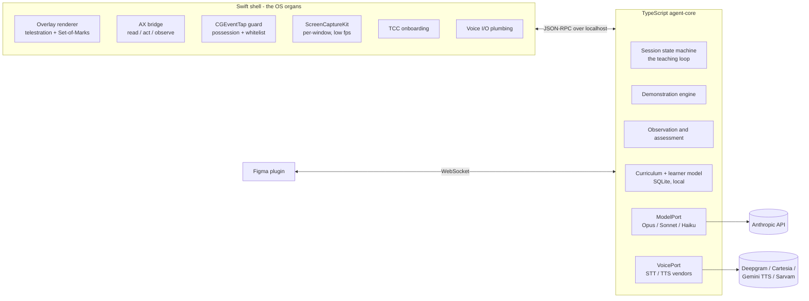

# The Live AI Tutor — Execution Plan v1

**Status:** Proposed execution plan against the concept constitution ("Concept brief: the live AI tutor"). The constitution decides the soul; this document decides the machine. Everything here is contestable and changeable; the loop, the principles, and the inversion are not.

**Provenance:** Drafted 2026-08-02 from a nine-agent verified research and design pass, then adversarially reviewed by four independent reviewers (technical feasibility, constitution compliance, market, trust/safety/legal). All 27 findings — 5 blockers among them — are incorporated below. The research memos, design memos, and the full findings file live in `notes/`.

**Assumptions:** a founding team of **2.5–3 engineers, plus the founder acting as FCP domain expert, plus one hired learning engineer** (≈4–4.5 people — the content pair is real headcount, not a footnote), starting ~September 2026. Change the team, shift the dates; the sequencing logic holds.

**What would change this plan:** Apple shipping a macOS agent runtime, restricting Accessibility-based control, or moving further on AI inside Final Cut (Creator Studio already added AI-assisted features — watch WWDC); Anthropic or OpenAI shipping a consumer screen-aware tutor mode (their study modes are screen-blind today); a capable local vision model landing early (accelerates the cost roadmap); token-price deflation stalling (breaks the margin path); Figma closing the plugin localhost-bridge pattern (demotes the signature blackboard to fallback).

---

## 0. Decisions at a glance

| Decision | Choice | The price we pay |
|---|---|---|
| Platform | macOS-first; Windows (UIA + Agent Workspace) second; iOS/iPadOS structurally impossible | Small initial TAM; two scary permission prompts in onboarding |
| App shape | Native Swift shell (overlay, AX, event tap, capture, TCC, voice I/O) + local TypeScript agent-core, JSON-RPC over localhost | Two languages, a versioned IPC boundary |
| Agent core | Plain Anthropic TS SDK + tool runner with custom tools — not the Claude Agent SDK | We own the loop plumbing we do use |
| Models | Opus 5 for judgment moments, Sonnet 5 for narration/feedback, Haiku 4.5 for pre-screening — behind a vendor-agnostic ModelPort | Abstraction tax; per-model API differences handled explicitly |
| Demonstration | Scripted semantic steps down a capability ladder: T2 app adapters → T1 Accessibility → T0 computer-use; every step verified; failures become guided learner practice | Per-app adapter engineering; the tutor cannot improvise long demos |
| Control | Four possession modes (Watch/Together/Guide/Try); tutor may request control, never take it; any hardware input pauses it ≤100 ms; PID-targeted event delivery; in-whitelist containment (protected verbs, snapshots) | Ceremony that cannot be adapted away below a floor |
| Observation | Foveated: free semantic OS events continuously; frontier deep looks only on six named triggers, hard cap 80/hour; **plus a disclosed low-tier pre-screen frame every ~5 s during active practice** (migrating on-device) | Real cloud exposure during practice — disclosed, logged, and bounded, not hidden |
| Assessment | Live feedback from the event tape and AX reads; **artifact ground truth (FCPXML / Figma tree) at attempt boundaries via an announced snapshot ritual**; verbal answers last | Mid-attempt artifact truth is a proxy; the snapshot is a visible 2–4 s ritual, not free |
| Adaptation | Evidence-weighted Bayesian mastery per skill node; five-level scaffolding fade; **assistance-per-task and tutor-hours-to-competency must both trend down** | Aggressive fading will sometimes frustrate |
| Blackboard | Abstract Board IR; the tutor **asks** where to set up (Figma or built-in board) and remembers; board carries light retrieval checks | We ship and own a rendering surface |
| Voice | Cascaded two-plane pipeline (STT → LLM → streaming TTS); barge-in <300 ms; Nepali via Sarvam STT + Gemini Flash TTS; **no-training data terms are a launch gate** | No speech-to-speech magic; non-training STT rates cost slightly more |
| Curriculum | Lessons are declarative YAML Lesson Specs — semantic intents, machine-checkable rubrics, model-portable | 20–30 h to author each lesson until the Lesson Compiler exists |
| First domain | Final Cut Pro on Mac in the **Creator Studio era** ($12.99/mo, $2.99 edu, 1-month trial; $299.99 one-time still sold): audience = new FCP subscribers/trialists, CapCut/iMovie graduates, film students | The $49 tutor costs more than the $13 software — we argue competence is the expensive part |
| Pricing | Tutor-hours, metered: $49/mo incl. 5 h (founding 100: $39/4 h), $12/h top-ups, $9/mo alumni; chat unmetered; never flat-unlimited | Fights the "$20 unlimited AI" expectation; meter incentive is guarded by the hours metric |
| Economics | Launch ~$8/tutor-hour COGS (10–18% GM), migrate to ~$4.50 (≈50% GM); **CAC-negative until then — a seed raise is part of the plan, stated in §5.1** | Launch margins are transitional and thin |
| Distribution | Notarized direct download + Sparkle; Mac App Store is impossible for this product, not declined | Own billing and discovery |
| First milestone | M0 "the slice": one FCP lesson end-to-end on a stranger's Mac — ~37 engineer-weeks, **mid-Dec 2026–Jan 2027** window with named week-1 de-risking spikes | Nothing sellable before the slice proves the loop |

---

## 1. What we are building first

**The product v1 is a Final Cut Pro tutor for the Mac** — a native app called (working name) **the Tutor** that a learner downloads, grants four permissions through a staged, plain-language onboarding, and then works with in live sessions: theory on a board, demonstration inside the real Final Cut Pro, observed practice on real footage, honest feedback grounded in what actually happened on screen.

**Why Final Cut Pro — updated for the January 2026 reality.** Apple launched **Apple Creator Studio** on January 28, 2026: FCP, Logic Pro, Motion, Compressor, Pixelmator Pro and MainStage for **$12.99/month or $129/year — $2.99/month for students and educators — with a one-month free trial** (the $299.99 one-time purchase remains available). This kills the old wedge framing ("justify the $300 purchase inside your 90-day trial") and replaces it with a better one:

- **The funnel got bigger and faster.** A $12.99/mo — and especially a $2.99/mo student — entry price pulls far more people into FCP than a $300 box ever did. Every one of them hits the same wall: the software is now cheap; *competence is what costs*. The offer becomes: **be genuinely good before your first few renewal cycles.**
- The optics cut against us and we argue them head-on: yes, the tutor costs more than the software. So does every human tutor for every cheap instrument. The $49 is not software rent; it is metered hours of live one-to-one instruction — a unit humans have never sold below ~$35/hour, and specialist FCP tutors bill $40–100/hour on Wyzant today.
- FCP remains the **least-defended pro NLE**: Adobe's AI Assistant (June 2026) is a doing-agent inside Premiere and friends; Apple has begun shipping AI-assisted features in FCP via Creator Studio, but nothing that teaches. We claim the teaching slot before anyone else wants it — and we watch WWDC every June with a named response plan (§6).
- The **adapter is proven feasible**: CommandPost demonstrates that FCP's Accessibility tree supports deep control and observation; FCP's Command Editor lets us install a known command set and drive edits deterministically by keystroke; FCPXML v1.13 expresses project state for assessment.
- Editors live on YouTube: **the tutor teaching FCP on camera is natively watchable marketing.** And it is the constitution's canonical scenario, in the founder's own domain.

DaVinci Resolve is the deliberate fast-follow, not first: its scripting API is the best of any NLE, but external scripting went **Studio-only ($295) in Resolve 19.1**, so the deep adapter reaches only paying Studio owners — which makes it exactly the right *second* market (proven payers, same craft, reusable curriculum, opens Windows later). Figma gets built regardless as the blackboard adapter; as a *taught* domain it is third at most. Excel is the B2B chapter, deferred.

**The canonical session, mechanically.** Anup asks the tutor to teach him Final Cut. The tutor speaks a session contract ("I'll work only in Final Cut and Figma today; touch anything and control is instantly yours; double-Esc stops me cold") and shows it. Placement is **by doing, not quiz**: four observed micro-tasks in real FCP (~8 minutes) initialize his mastery profile. Theory happens on a board — and the tutor **asks first, the way the constitution tells it**: *"I can teach theory in your Figma, or on my own board — where should we set up?"* Anup says Figma; the tutor opens it, creates `anups_finalcut_learning`, draws the lesson through the plugin, and remembers the preference. Demonstration happens **inside FCP**: the overlay spotlights each target before the cursor moves, the cursor travels at human speed, narration lands at step boundaries, and every step is verified against the Accessibility tree before the tutor says "done." Then handover — "Your turn, keyboard's yours" — and the tutor goes quiet, watching through free OS events, looking only when a trigger fires. At the end of the attempt it asks for the mouse for a moment — *"let me grab a snapshot — one second"* — exports the project XML, hands control straight back, and the debrief quotes what the timeline actually contains. Next session, the help gets smaller. That shrinking is the product.

---

## 2. System architecture

Two processes on the learner's machine, five engines between them.



**The Swift shell owns everything that touches the OS**: the transparent click-through overlay (an NSPanel at screen-saver level that draws above fullscreen apps — proven telestration technique); the Accessibility bridge (element reads, actions, and AXObserver notifications — the live semantic feed of what the learner does); a listen-only CGEventTap; the ScreenCaptureKit pipeline; permission onboarding; microphone and audio playback. **The TypeScript agent-core owns everything that thinks**: the teaching loop, curriculum, learner model, model calls, voice orchestration. They speak typed JSON-RPC over a localhost WebSocket; every model-visible tool (`screen.observe`, `ax.act`, `input.key`, `overlay.draw`, `figma.canvas`, `voice.say`) is an IPC call **the shell can refuse**.

Two capture rules learned in review: **all observation and verification capture excludes the shell's own overlay windows** via ScreenCaptureKit's content filter — screenshots show the learner's screen as if the tutor were not drawing on it (a separate, deliberate composited mode exists for Set-of-Marks grounding of T0 actions); CI asserts captured frames contain no overlay pixels. And **synthetic keyboard events are posted to the target app's PID** (`CGEventPostToPid`), never system-wide — see §3.2.

Alternatives were examined and killed: pure Swift (re-implements SDK plumbing where product risk actually lives), Electron/Tauri (the hard 20% must be native anyway; adds bulk and AX quirks), browser-extension-only (cannot see or drive Final Cut — violates principle 1 fatally), cloud-VM streaming (teaches on a machine that is not the learner's — violates principles 1 and 7). iOS/iPadOS cannot host this product — no cross-app accessibility control, no event injection, no system overlay; that is an OS-policy fact, not a roadmap item. **Windows is the second platform**: UIA parallels AX, Windows 11's Agent Workspace is an OS-native tailwind, and only the shell needs rewriting — the agent-core, curriculum, and learner model port unchanged, which is the strongest argument for the split.

**The teaching loop is code, not vibes** — an explicit, journaled state machine: `EXPLAIN → DEMONSTRATE → ATTEMPT → FEEDBACK → ADAPT`, plus `PAUSED` and `RECOVERY`. **Possession is an orthogonal axis** (`TUTOR / LEARNER / IDLE`) enforced *in the shell*: the event-posting function refuses to act unless the core holds a possession lease, and hardware input revokes the lease. An append-only SQLite journal records every transition, action, and observation; after a crash mid-demo the core re-grounds from a fresh AX snapshot against the last verified step, then apologizes like a human ("I lost my place — the timeline shows the cut at 0:12, let me pick up from there"). Never blind replay.

**Model layer.** Behind a vendor-agnostic ModelPort, Anthropic-primary: **Opus 5** ($5/$25 per MTok) for demonstration supervision, assessment moments, planning, and recovery; **Sonnet 5** ($3/$15) for narration and feedback turns; **Haiku 4.5** ($1/$5) for pre-screening. The static lesson pack (system prompt, tool definitions, concept text, step scripts, rubric) is a frozen cached prefix (1-hour TTL, ~0.1× read price). Volatile session state is injected **after** the cached prefix — as mid-conversation system messages on Opus 5, and as `<system-reminder>` blocks inside user turns on Sonnet 5 and Haiku, where the system role mid-conversation is not supported — so the frozen prefix never invalidates on any path. Cache-discipline CI asserts per-model request builders never touch the prefix (one cache-buster in the loop multiplies COGS ~6×). The core sits on the **plain Anthropic TypeScript SDK + tool runner**, not the Claude Agent SDK — the Agent SDK is Claude Code's harness (file tools, bash, coding permissions), none of which a teaching loop uses, and the computer-use tool must be wired as a custom tool either way.

The strategic reason the port exists: the model vendor could ship a tutor mode someday. **The moat must live in the curriculum packs, the per-app adapters, the longitudinal learner model, and the trust posture — never in raw model capability.**

---

## 3. The hard problems, decided

Each subsection: the decision, why, what it costs, what stays risky.

### 3.1 Demonstration: verification-first, down a capability ladder

A demo that misclicks *teaches the wrong thing*. Current ground truth: frontier computer-use agents hit ~85% on short scoped GUI tasks (OSWorld-Verified) but only ~20–55% on long-horizon work (OSWorld 2.0), at 2–6 seconds per improvised action. That settles the architecture: **demonstrations are scripted semantic steps, executed over deterministic channels, verified after every step — the live model supervises, repairs, and answers questions; it does not improvise long demos.**

**The capability ladder.** A per-app registry maps each action to the highest available tier:

- **T2 — app adapters** (deterministic, millisecond-fast). Figma: a private development plugin whose UI iframe holds a WebSocket to the tutor — the established bridge pattern; it draws the blackboard programmatically. Final Cut: an installed known command set driven by keystroke injection (the channel CommandPost proves), FCPXML import for prepared exercise projects, FCP's AX tree for grounding and verification. Resolve: the scripting API where Studio is detected.
- **T1 — macOS Accessibility** (semi-deterministic, millisecond-fast): element-targeted presses, menu picks, value sets — works across most native apps.
- **T0 — computer-use vision** (probabilistic, 2–6 s/action): Claude's `computer_20251124` tool with Set-of-Marks grounding and zoom — the universal fallback that makes every app teachable at *some* rung.

**The command-set channel, specified** (review finding): the tutor's FCP command set is the **FCP default plus automation bindings on otherwise-unused keys** (F13–F19 / hyper chords), so everything the learner sees demonstrated by shortcut matches what their own keyboard will do after the session. It is installed at onboarding and activated/deactivated through a verified AX menu action at session start and end, with the learner's prior command set **restored on exit and on crash recovery** (journaled). Onboarding detects a customized learner set and asks before shadowing it — the FCP.cafe power users we court are exactly the people with custom keys. Every T2 keystroke step's precondition includes the **required focused pane** (timeline vs browser vs viewer), verified via AX before posting — FCP shortcuts are focus-sensitive.

**Step lifecycle: PLAN → TELEGRAPH → ACT → VERIFY → NARRATE.** Preconditions are checked against live AX state; the overlay spotlights the target *before* the cursor arrives (nothing is ever touched that wasn't first highlighted); every synthetic event is tagged so the interrupt tap can tell tutor from learner; the postcondition is checked (AX predicate first — free and instant; screenshot+zoom only where AX is blind, like FCP's viewer canvas); narration speaks intent at telegraph and outcome **only after verification passes**. Two retries maximum; the second may drop a tier.

**Failure becomes pedagogy, never pretense.** When a step exhausts retries, the engine runs the step's conversion script: *"It's not letting me — you click it for me. The blue Inspector icon, top right."* Same overlay target, same postcondition, now verified against the learner's action. The honesty ladder is strict: retry → drop tier → convert to learner-performed step → show a reference image and describe → defer and log ("I can't demonstrate this here today — flagged; let's continue"). The learner's record distinguishes *demonstrated* from *described*, so the tutor's capability claims stay grounded too.

**Reliability gates — restated after review caught an arithmetic contradiction.** Raw per-step targets (T2 ≥99.5%, T1 ≥97%, T0 ≥90%) are *instrumentation* targets. The Watch-mode gate is defined over **post-recovery success**: *a segment may run as a hands-off Watch demo only when the predicted compound probability that every step verifies within its retry-and-tier-drop budget is ≥95%.* Under that definition a 20-step T2/T1 demo passes comfortably (per-step post-recovery success ≥99.9% when failures are detectable and retryable); under the naive raw product it would not — and engineering would have hit the contradiction on day one. T0 steps are allowed inside Watch segments **only where a T1/T2 verify channel exists to make their failures detectable**, capped at 5 per segment. Fluency demonstrations — where speed *is* the content, like J-K-L trimming — must run on T2; **T0 is banned for fluency demos**, because 2–6 s/action would demonstrate hesitation, the opposite of the lesson. Concept-paced steps are the mirror image: the telegraph-act-verify rhythm at deliberate speed is *better* teaching than a fast blur (Mayer's segmenting principle), so latency there is a feature.

**Watchability.** One overlay surface, eight primitives (spotlight, arrow, caption, Set-of-Marks labels, cursor ghost, pulse with key-chip for keystroke actions, possession badge, clear). The real cursor moves on an eased, speed-capped path (~900 px/s, ≥350 ms minimum travel) so the eye can track it; a 12-step demo deliberately takes 2–4 minutes with narration. We are not optimizing throughput; we are optimizing encoding.

**Trade-offs accepted:** adapters are real engineering per app and fragile across app updates (mitigation: version-pinned command sets, CI against FCP/macOS betas); the tutor cannot improvise a novel 30-step Watch demo on request — it offers Guide mode instead. **Constitution:** makes P2 reliable instead of probabilistic; the ladder — not the adapters — is what keeps P6 true (any app is teachable at some rung).

### 3.2 Control: the possession protocol, and containment inside it

Principle 7 made mechanical. Four modes, mapped to cognitive apprenticeship: **Watch** (tutor drives — modeling), **Together** (tutor may micro-act, each action individually approved — scaffolding), **Guide** (learner drives, tutor talks and telestrates — coaching), **Try** (learner drives, tutor silent — fading). The default arc per concept is Watch → Together → Guide → Try, and mode selection is itself an adaptation surface.

The hard guarantees, all enforced in native code below the model:

- **The tutor may request control; it can never take it.** Learner-to-tutor handover requires an explicit grant; the tutor announces ("Taking the mouse — eyes on the timeline"), the badge flips, a chime sounds, one second of grace before the first event.
- **Any hardware input pauses the tutor in ≤100 ms.** A listen-only event tap classifies every event by source: hardware state ID plus the absence of our synthetic tag means *real learner input* → the executor gate flips in-process, the synthetic queue aborts, any in-flight model action is discarded at the gate. Acknowledged visibly (badge → "You have control" within a frame) and audibly (tick, narration truncates in <300 ms). An interrupted drag posts mouse-up where it is, marks the step failed, and verification runs — the tutor never claims an aborted action completed.
- **Right-app delivery, not just right-app intent** (review finding — the check-then-post race). All synthetic keyboard events are posted with `CGEventPostToPid` to the whitelisted target app's process, never system-wide, so a notification banner or surprise dialog grabbing focus between check and delivery cannot receive the tutor's keystrokes. Mouse events re-verify the target element's owning window via AX immediately before delivery. Any focus-change or app-activation notification aborts the in-flight synthetic queue exactly as hardware input does.
- **Panic: double-Esc = full stop.** Event posting killed, held modifiers released, overlay cleared, mode drops to Try; resumable only by explicit re-invitation. The always-visible badge carries a stop button that does the same.
- **Scope: the session whitelist.** The session contract names the apps the tutor may touch. The shell checks before every synthetic event; anything else hard-pauses and asks. The tutor never acts in Mail, browsers, or System Settings, including during repair. Because this check lives below the model, a prompt-injected screenshot cannot make the shell act outside the whitelist; Anthropic's injection classifiers on computer-use screenshots are a second layer, not the enforcement.
- **Containment *inside* the whitelist** (review finding — the whitelist scopes where, not what). (1) Sessions run in a **dedicated tutor-created FCP library**; the tutor does not operate while the learner's personal library is the open target. (2) An executor-level **forbidden-verb list** — delete library/event, move media to trash, empty trash, overwrite-without-copy, close-without-save — requires explicit learner confirmation in *every* possession mode, enforced in the shell like the whitelist. (3) A **pre-step snapshot** (FCPXML / file copy) is taken before any destructive-class step — an undo ledger the RECOVERY state can restore from; verification detects, the ledger restores. (4) Filesystem writes are confined to the lesson folder. This also contains injection-steered in-scope destruction: screen content may fool a model; it cannot confirm a forbidden verb on the learner's behalf.

**Trade-off:** Together mode's per-action consent is slow and slightly ceremonial, and explicit-grant-only means the tutor sometimes waits for permission it pedagogically "should" have. Accepted without apology: a tutor that ever surprises the learner's hands loses the session and poisons the category. **Constitution:** P7 realized; the learner grabbing the mouse mid-demo is also *data* (P3).

### 3.3 Observation and honest assessment

Naive screen-streaming is disqualified by arithmetic before philosophy: a frontier model watching a frame every 2 seconds costs ~$26/session-hour cached ($150+ uncached). **Foveated observation is not an optimization; it is the existence condition of the business.**

**Two layers — described honestly.** The **continuous layer** is semantic and ~$0: AXObserver notifications, the listen-only input tap, app/window focus, and adapter state reads. During active practice a **Haiku pre-screen additionally sees roughly one low-cost frame every 5 seconds** to catch what events can't express. That is a real cloud exposure — ~720 small frames per practice-hour — and the plan's trust surfaces say so plainly (§4), count it in the "What your tutor did" log, and name its migration on-device as the Architecture-C roadmap. A learner can decline it per session and run events-only observation, with the quality cost stated. The **deep layer** is a frontier-model look — **only on six named triggers**: learner asks a question; learner claims completion; a rubric checkpoint matches; a suspected-error signature fires (≥3 undos in 30 s, menu wandering, oscillating values); idle >20 s during an attempt; and a 90-second watchdog bounding silent divergence. Hard cap: **80 deep looks per hour**; Sonnet by default, Opus on escalation. Worst case ≈ $1.70/hour observation spend, ceiling $3. On budget exhaustion the tutor degrades to events and artifacts **and says so** — never silently.

**The artifact channel, redesigned after review.** The draft assumed FCPXML could be exported silently in the background every few minutes. **macOS does not allow that**: FCP's XML export is user-initiated (Apple's own workflow documentation is explicit), reachable programmatically only by driving the menus — which would steal focus from a practicing learner and violate the possession protocol. So the design is now honest about tiers of truth:

- **During attempts**, live feedback runs on the **event tape and direct AX-tree reads** of the timeline (clip layout, selection, playhead — the surface CommandPost proves readable). This is the mid-attempt state proxy.
- **At attempt boundaries and debrief**, the tutor performs an **announced snapshot ritual** — "let me grab a snapshot — one second" — a possession-granted, 2–4 s automation that drives Export XML through the command-set/AX channel, restores focus, and hands control straight back. This automation carries its own T2-grade reliability target and an M0 exit gate. **FCPXML is boundary-time ground truth; it is not a live feed.**
- Where a lesson ends in an export, the exported file itself is asserted (duration, resolution, codec).

**Assessment order stands: artifact → fluency → verbal** — with the artifact evidence arriving at boundaries. Fluency signals (time-to-first-action, hesitation distribution, undo rate, and self-correction — the strongest positive signal there is) are secondary evidence, live. Verbal answers count least: the METR result (developers 19% slower while believing 20% faster) is the standing proof that self-report is unreliable. Every lesson carries a versioned rubric in the same event grammar the observer emits.

**The semantic layer is validated, not assumed** (review finding). CommandPost proves FCP's AX tree is rich for *reading*; nobody has measured how densely FCP *emits notifications* for timeline drags, blade cuts, and trims on its custom canvas. **M0 week 1 runs a named spike**: instrument AXObserver against ~20 canonical editing actions and measure coverage. The fallback is designed now, not improvised later: AX **hit-testing at every observed click** (element-at-position lookup) plus keystroke-to-command mapping through the installed command set reconstructs semantic events from the input stream even if notifications are sparse. If semantic coverage still falls short, the look budget is re-derived and the change is priced before M1 — not discovered in the field.

**The mastery model** is deliberately simple: per-skill-node Bayesian updates in log-odds with evidence-class weights (**artifact ±2.0, fluency ±0.7, verbal ±0.3**, capped ±3.0 per session per node), decay toward the prior with a 7-day half-life that stretches ×1.8 with each spaced success, and a review queue when decayed mastery crosses 0.6 — expanding-interval retrieval practice, wired in. Crude versus learned knowledge tracing, and chosen anyway: it is explainable to the learner ("here's why I think you've got blade cuts but not J-cuts") and debuggable by us.

**Feedback policy: the tutor's default during attempts is silence.** No unsolicited help before **45 seconds of productive struggle** — a per-learner dial with a floor of 20 s (struggle ≠ idle; 20 s of idle gets "stuck, or thinking?" — a question, not a rescue). **Two unsolicited interruptions per attempt**, then everything queues for the debrief. Immediate interruption is reserved for destructive actions and compounding errors. Praise is generated *from assessment output* and is structurally impossible when the artifact assertions fail — honesty enforced by wiring, not by prompt. This deliberately trades away some of the constitution's "mistakes spotted the moment they happen" for deliberate-practice evidence; §9 records the strain. A mistake the learner discovers is worth more than one the tutor prevents.

**What is honestly hard, admitted in writing:** taste ("does this cut *breathe*?") gets a mastery-confidence ceiling of 0.7 and is assessed at debrief by comparative critique, labeled as opinion, never as measurement. Errors that change no app state are covered only probabilistically — the watchdog bounds exposure to ~90 s. Multi-monitor setups bind to one declared practice display in v1.

**Constitution:** P3 implemented at a cost that lets it exist; P5 *is* this section; the look budget and the boundary-time artifact truth deliberately strain P3/P5's maximal reading in service of P7 and solvency — recorded in §9, not hidden.

### 3.4 Voice and language

Anthropic has no developer voice API, so the voice layer is cascaded by necessity — which is convenient, because cascaded is also the only architecture that can speak Nepali today. **Two planes, kept separate:** the action executor emits step events; a narration plane (Sonnet → streaming TTS) consumes them and speaks at step boundaries. TTS streams are independently cancellable, so **barge-in kills the audio in <300 ms without killing the executor** — and hardware input pauses the executor itself (§3.2). Coupling voice and action in one speech-to-speech loop would make interruption ambiguous; we refuse that ambiguity.

Vendors, behind a VoicePort — **with data terms as a launch gate, not an afterthought (§4)**: STT — Deepgram Nova-3 streaming primary **with training opt-out mandated** (the opt-out changes the discounted rate; §5 carries the corrected line), Apple's on-device SpeechAnalyzer as the English cost/privacy floor, **Sarvam Saaras for Nepali** (native Nepali plus code-mixing, <150 ms streaming) — gated on verified no-training data terms, not just voice quality. TTS — Cartesia Sonic for English (~90 ms to first audio), **Gemini Flash TTS for Nepali** (~$0.03/min, production-validated in the wild; ElevenLabs is the quality ceiling at 10× the price). Latency budget: barge-in <300 ms hard; simple replies <800 ms; substantive answers 1–1.5 s masked by continuers.

**Language policy: measured by default, overridden on request.** The tutor mirrors the learner's *observed* Nepali-English code-switch ratio within ±10 points, keeps tool vocabulary in English ("Blade tool" inside a Nepali sentence — FCP's UI is English), and shifts toward the learner's primary language when frustration runs high. But an explicit request — "English only, please, I'm preparing for an English-speaking studio" — **always wins and persists**: measurement distrust applies to capability claims (P5), never to stated preferences (P4, P7). An English-only session can run fully local at $0 marginal voice cost; Nepali requires cloud vendors, and the product says so plainly.

### 3.5 The blackboard

The constitutional tension, resolved explicitly — and, after review, with the constitution's own move restored. Board content is authored once in an abstract **Board IR** (frames, clip diagrams, arrows, labels); renderers are interchangeable: a **built-in board** (native canvas + the telestration overlay) is the universal renderer, and the **Figma adapter** (private plugin, WebSocket bridge, app-launch via AX) is the signature upgrade. **The tutor asks, the way the canonical scenario tells it** — *"I can teach theory in your Figma, or on my own board — where should we set up?"* — and remembers the answer; detection (installed, handshake <5 s) governs what is *offered*, not what is imposed. Two hard rules: real-time telestration during demos and practice is *always* the built-in overlay, and no lesson may ever block on a third-party board. When the subject *is* Figma, the board is Figma by definition.

The board also keeps its constitutional **assessment role**: Board IR supports light retrieval checks — the learner arranges or labels a diagram ("drag the trim types onto the right clips"), graded through the Figma node tree or built-in board state by the same artifact-first machinery. Theory gets checked where theory was taught.

**Trade-off:** we ship and own a rendering surface, and the "professor walks into your own studio" purity is diluted where the built-in board appears. **Constitution:** knowingly strains P1; the resolution is that the *practice* app — where skill actually forms — is always real. The board is pedagogy furniture, and a first-party board never touches learner files (P7).

### 3.6 Curriculum as data

**A lesson is a declarative, versioned YAML Lesson Spec containing zero model prompts and zero screen coordinates.** Actions are semantic intents (`fcp.ripple_trim {delta_frames: -12}`) resolved by the per-app executor; checkpoints and rubrics are machine-checkable predicates over the AX tree, the event tape, or a boundary FCPXML diff. That is what makes the spec **model-portable**: swap the engine's model and only execution reliability changes — content, checkpoints, and grading are untouched. The annotated sketch is Appendix A; the load-bearing parts: explain segments with Board IR plans and depth variants; demo steps with narration beats and per-step verify predicates; a practice task with **starter assets** (a prepared `.fcpbundle` with keyworded, marked footage — practice starts in seconds); the rubric; a hint ladder mapped to scaffold levels; remediation branches keyed to named error patterns; spaced-review items.

**FCP course v1: 5 units, 21 lessons, zero to a real exported video.** U1 interface & the library model (incl. a J-K-L navigation drill) → U2 import & organize → U3 *The Cut* (the drill-dense heart) → U4 timeline ops & audio → U5 color & export, ending in a **capstone edited at zero scaffolding — the honest exam**. Deliberately narrow; breadth is v1.1.

**Authoring economics, stated honestly:** hand-authoring runs an estimated 20–30 hours per lesson early, falling to 12–15 with templates — roughly 350–550 hours for the course, executed by **the founder (domain expert) + the hired learning engineer**, who are in the headcount (§7) precisely because review caught them missing. Replay-testing requires the engine, so authoring and engine development interleave: specs and assets first, replay-tests as M0 hardware lands, cohort 1 launches on **Units 1–3** with the rest shipping during the design-partner period. That cost is acceptable exactly once, which is why the **Lesson Compiler** is v2: an expert teaches naturally on an instrumented Mac; the pipeline aligns transcript to events, segments explain vs demonstrate moves, lifts event runs into semantic intents *with verify predicates auto-generated from before/after AX and FCPXML diffs*, drafts narration, board plans, rubric, and hints; a human reviews in 3–6 hours and a mandatory replay test gates release. Every real tutoring session feeds the error-pattern library — **the content flywheel**. v3, one paragraph, on purpose: experts publish Lesson Spec courses that *execute as live tutors*; the replay test is the listing gate; the platform keeps what no author can replicate — the cross-course error library, the executor libraries, the longitudinal learner models. The catalog, not the model, is the durable moat.

### 3.7 The scaffolding fade — the inversion, operationalized

This section is why the product deserves to exist, so it gets its own number.

**Five help levels:** L4 full demo → L3 partial demo → L2 hint overlay → L1 verbal nudge → L0 nothing. Start level set by mastery band; **after any task completed with little help, drop a level for that skill; raise one only after two consecutive failures or a frustration spike; hard cap of one full demo per skill per session** — a second request gets L3 with the learner's hands on the mouse.

**Two anti-dependence metrics, because review found the meter's conflict of interest.** First: every task logs an assist score (L4=4, L3=2, L2=1, L1=0.5). **Assistance-per-task must trend down per skill per learner**; a flat or rising slope across three sessions force-caps scaffolding one level lower — the tutor is structurally forbidden from drifting into a doing-agent. Second — the guard the first metric cannot provide: metered pricing means the company earns more the longer a learner needs tutoring, so the dashboard carries **median tutor-hours-to-capstone per cohort, published alongside completion rates**, with a stated band and a required downward trend as curriculum and engine improve. A tutor could keep assist slopes beautifully negative while teaching slowly; this metric would catch it. Standing commitments: **pacing, time-boxes, and review scheduling are never tuned against revenue**, and unused rolled-over hours convert to alumni-mode credit at graduation. Every other AI product's engagement metric measures how much users lean on it; this one's health metrics measure how fast they stop needing to — per task *and* per hour.

**Trade-off:** aggressive fading will sometimes frustrate — accepted for transfer, bounded by the frustration signal. **Constitution:** these metrics guard the product's reason to exist; "not a task agent" is enforced by wiring, not by mission statement.

---

## 4. Trust architecture

Trust is a concept-level requirement, so it gets first-class engineering — and, after review, claims that match the mechanics exactly.

**Permissions: staged, just-in-time, value-first.** Four TCC asks, never bundled: **Microphone** at first launch ("talk with your tutor"). **Screen Recording** before lesson one ("so I can see what you see"), followed immediately by the tutor demonstrating the value — narrating the learner's actual screen. **Accessibility** right before the first demonstration ("so I can drive the mouse when I demonstrate — touch anything and control is instantly yours"). **Input Monitoring** before first observed practice ("so I can see your shortcuts while you try"). Each card says what it enables, when it's used, and what leaves the machine. Every denial has a defined degraded mode. macOS 15's monthly screen-recording re-approval nag is pre-empted in-app so it never reads as a betrayal.

**What the tutor sees — the honest version.** During active practice the tutor's continuous understanding comes from semantic OS events, **plus a low-tier model that sees roughly one frame every 5 seconds** (disclosed here, in the data map, in onboarding, and counted in the session log — not "looks rarely"); frontier models see at most 80 frames/hour, on named triggers. Frames are **ephemeral on the learner's machine** — analyzed, never written to local disk, never used by us for anything but the session. What persists locally is the semantic layer: event summaries, assessments, mastery state — learner-inspectable, learner-deletable.

**Where frames and audio go — the per-vendor truth** (review replaced our absolute language with the vendors' actual terms):

| Vendor | Data sent | Retention | Training use | Our obligation |
|---|---|---|---|---|
| Anthropic (LLM) | Screenshots, event-tape excerpts, dialog | ~7 days standard; up to 2 years if flagged by safety systems | Not used for training | Pursue zero-data-retention agreement as we qualify; disclose the flag pathway honestly |
| Deepgram (STT) | Session mic audio | Per contract | **Trains by default** — opt-out mandatory | `mip_opt_out` on every request; signed no-training DPA is an M1 gate; COGS carries non-discounted rate |
| Google (Gemini TTS/paid) | Narration text | ~55-day abuse logging | Not trained on paid-tier prompts | Disclose in data map |
| Sarvam (Nepali STT/TTS) | Cohort mic audio, narration | **Unverified** | **Unverified** | Data-terms verification is part of the Nepali-cohort gate, alongside voice quality |
| Apple SpeechAnalyzer (local) | Nothing leaves the machine | — | — | Preferred English path |

The one-page data map ships as this table plus processing regions. Signed DPAs or no-training terms with every voice vendor are an **M1 launch gate**.

**The keystroke boundary** (review finding — the tap was a session-long global keylogger). The event tap is scoped in the Swift callback itself: **keystroke and click events are dropped at the tap whenever the frontmost app is not on the session whitelist** — at most an activity-present boolean survives. A learner who cmd-tabs to Messages mid-session types into a void as far as the tutor is concerned. Cloud-bound event-tape excerpts carry **semantic command events only** (menu and command names), never raw typed character streams. macOS's SecureEventInput additionally blinds the tap on password fields — one layer, and the tutor says so ("password field — I can't and won't see this") — but the frontmost-gate is the actual boundary. A **default app blocklist** (banking, Mail, Messages, password managers) is enforced at the capture-filter and AX-attach level; blocked apps never enter any frame. An optional session recording belongs to the learner, on the learner's disk. The **append-only, hash-chained action log** — every synthetic event with target and lesson step, every permission use, every pre-screen frame count — is surfaced in-app as "What your tutor did."

**Duty of care** (review finding — cheap to specify, expensive to improvise). The tutor observes adults under stress by design, so its responses to distress are fixed policy, not improvisation: verbal despair cues get acknowledgment, no diagnosis, an offer to pause, and a single signpost to help resources — never nagging. Concerning content seen in-frame inside the practice app is never stored, never assessed, never surfaced beyond a neutral offer to stop. Frustration signals are used for pacing and language adaptation only, and the data map says so. These behaviors are wired into the system prompt as policy and covered by the seeded-error QA suite.

**Compliance workstream — deadline M1** (review finding: the plan budgeted SOC 2 and zero consumer-privacy work). (a) Recording consent for the YouTube channel is a **separate, revocable, review-before-publish agreement** with a mandatory redaction pass and a withdrawal window — never a waitlist checkbox. (b) GDPR readiness for diaspora learners: vendor DPA stack, privacy notice, deletion rights that reach synced learner models; counsel opinion on the EU AI Act's emotion-recognition provisions as applied to the frustration signal *before* serving EU learners. (c) Nepali-cohort consent documents covering cross-border transfer under Nepal's Individual Privacy Act 2075, gating the cohort launch. (d) Age gate: 18+ attestation **plus payment card plus application review**, with under-18 applications rejected explicitly; a supervised-teen mode is future work with its own review.

**Containment.** The session whitelist, PID-targeted delivery, forbidden-verb confirmations, and pre-step snapshots (§3.2) are all enforced below the model. **Distribution** is a Developer-ID-signed, notarized direct download with Sparkle auto-updates — the Mac App Store is *impossible* for this product (sandboxed apps cannot hold Accessibility control or post events), not declined. Telemetry is opt-in and count-level only.

The honest sentence that anchors all of it: *maximal observation would make a sharper tutor, and we bound it anyway.* The learner can decline the pre-screen and run events-only observation, and the product will say plainly what that costs in feedback quality.

---

## 5. Economics

**COGS per tutor-hour** (all-in: LLM + voice; arithmetic in `notes/research-unit-economics.md`; voice line adjusted upward slightly for no-training STT rates per §4):

| Architecture | What watches | $/tutor-hour | Status |
|---|---|---|---|
| A. Naive streaming | Frontier model, frame every 2 s | ~$26 cached; $150+ uncached | **Disqualified** — kills consumer pricing; uncached exceeds a human tutor |
| B. Foveated (launch) | Free OS events + Haiku pre-screen trigger ≤80 frontier looks/hr; Sonnet narration | **~$8** (LLM $5–6 + voice $1.5–3) | Launch architecture |
| C. Local-first (target) | Local model watches continuously; frontier at checkpoints | **~$4.50** | ~12-month migration |

The demonstration phase (~90 verified actions with screenshots) is the irreducible floor — ~$1.3–2.5/session under every architecture. Cost discipline is engineering: one cache-busting bug multiplies COGS ~6×; screenshot cadence during practice is the single biggest dial. Token prices are falling roughly 2×/year, so B's economics become today's C even before the local-model work lands.

**Pricing: sell tutor-hours, not chat access.** Flat-unlimited fails at every tested price for a heavy user — the margin table says so, and the margin table wins. Structure: **Core $49/mo including 5 tutor-hours** (launch GM 18% under B → 54% under C); **Serious $89/mo / 10 h**; **top-ups $12/h**; **founding 100 at $39/mo / 4 h, locked 12 months**; **alumni mode $9/mo**; hours roll over one month (converting to alumni credit at graduation); annual = two months free. Q&A chat outside live sessions is **unmetered** — the meter applies only to the expensive planes. The meter's conflict of interest with the inversion is real and guarded (§3.7): hours-to-competency is a published health metric, and pacing is never tuned against revenue.

**Price integrity in the Creator Studio era.** The software now costs $12.99/month; the tutor costs $49. That comparison is the wrong one, and we make the right one explicitly: the comp is the human it substitutes for — *a human FCP tutor charges $60 an hour and forgets you between sessions; this one is ~$10 an hour and remembers every keystroke* — and the price is defended by the three things a free screen-watcher cannot do: **demonstrate in your app, grade your actual timeline, and remember your skill graph** (§6). We sell hours of live instruction into the corridor between content subscriptions (~$14–33/mo) and human tutoring ($40–100/h). Launch margins of 10–18% are transitional and named as such.

### 5.1 Financing and runway (added after review: the draft never said who pays for the transition)

The plan is **not bootstrappable**, and pretending otherwise would be its quietest lie. At launch margins, contribution per customer over a full lifetime ($49 × ~8 months × 10–18%) is $33–88 — below even a $100 blended CAC — so **unit economics are CAC-negative until the B→C migration lands**. Meanwhile the team (≈4–4.5 people), COGS on ~500 users (~$16k/month at scale), content authoring, concierge onboarding, and the compliance workstream put fully-loaded burn at roughly **$70–100k/month → on the order of $1.2–1.6M cumulative through commercial month 12**, before revenue is material. The financing plan, stated: a **pre-seed/seed raise of ~$1.5–2.5M** around the M0 slice (the demo *is* the pitch), giving ≥18 months of runway through the design-partner phase and the margin migration; the alternative default-alive configuration (founder + 1.5 engineers, slower calendar, consulting subsidy) is possible but adds ~2 quarters to every date. Kill-criterion 3 (deflation thesis fails) therefore has a cash consequence: it triggers repricing *and* a runway re-forecast, not just a pricing memo.

---

## 6. Go-to-market

**Category: the Live AI Tutor. Positioning: "Every AI agent does your work. This one makes you the one who can."** The agent zeitgeist is the foil, and the evidence file is the ammunition: Lancet 2025 (endoscopists' unassisted detection −20% relative after months of AI assistance), METR 2025 (developers 19% slower while believing themselves 20% faster), the novice-programmer "widening gap." Secondary claim no screen-blind product can copy: **honest assessment** — "we grade what we watched you do, not what you feel."

The landscape check (verified August 2026) says the slot is empty: **no shipped product combines demonstration-by-acting, observation of the learner's own attempts, and skill-building intent.** The labs' study modes are Socratic but screen-blind; Copilot Vision and Gemini Live watch and point but never act or assess; Screen Copilot guides but cannot demonstrate; Adobe's assistant does the work instead of teaching it; digital-adoption platforms are vendor-owned click-guides; Cluely sells substitution. Every adjacent player is captured by its business model.

**The competitive response playbook** (review finding: "the slot is empty" is a fact, not a moat). The nightmare is a free fusion of Gemini Live screen-share + Guided Learning — approximately our Guide mode, free, no install, no permission prompts. Leading indicator, reviewed monthly: exit-survey mentions of free screen-aware tools, and offer→paid trend. Day-one response if it ships: reposition hard on the three things guidance cannot do — **demonstrate in your app, grade your actual FCPXML, remember your skill graph** — publish completion and assessment-outcome data as the proof asset, and accelerate the B2B pull-forward (enterprises will not run employee screens through a free consumer Google product). Pricing contingency: the unmetered chat tier becomes a free assessment-teaser tier. The moat is the loop plus three compounding assets — the per-app adapter library, the error-mined curriculum graphs, the session-content flywheel — and none of them is the screen-watching, which is already free.

**Channels, in order.** (1) **The demo is the content**: a weekly YouTube series of full consented sessions (under the §4 consent regime — separate, revocable, redaction-passed) — the tutor teaching a real learner FCP on their real Mac — plus shorts of the money moments: the live mistake catch, the mouse handover, the Nepali-English explanation. The product performing *is* the ad. (2) **Communities**: FCP.cafe (CommandPost's home — exactly our power users), r/finalcutpro, editing Discords, film schools — leading with **free live skill-assessment sessions, which are also the product trial** (kill-criterion 2 measures offer→paid from them). (3) **Application-gated waitlist**, admitted in cohorts of 20–30 so demo reliability and observation load stay debuggable. (4) **100 founding design partners** at $39, weekly feedback calls, named in the credits.

**The Nepali-English cohort — signature, budgeted, off the critical path** (review costed what the draft romanticized). ~30 learners; **engineering budget capped at ≤4 engineer-weeks** (Sarvam + Gemini TTS integration, code-switch policy, validation); recruitment is **diaspora-first** (US/UK/AU incomes can pay $39–49; Kathmandu students join at a subsidized founding rate accounted as marketing spend, honestly); it ships **only after the open-cohort reliability gates are green**, contributes zero to the month-6 payer target, and is gated on Sarvam's *data terms* as well as its voice quality. It remains what it was: principle 4 made real on day one, and content no US competitor will bother to copy.

**No paid acquisition** until referral rate ≥25% of signups and week-4 retention ≥40% are measured. **The churn truth, faced:** a good tutor graduates its students; FCP competency is a ~3–4 month arc, and we will not engagement-farm — the assist metric and the hours metric forbid it structurally. Plan on 10–15%/month mature churn. **Blended LTV, defined honestly** (review caught the $390 flattery): a modeled customer life of ~4 months at Core plus ~6 months of alumni at $9 yields **≈ $250 gross blended** (founding-cohort and alumni mix included), which is the number the CAC ceiling is built on — "payers" in every target below means **Core/Serious actives, with alumni counted separately**. The answers to graduation churn are structural: the multi-skill roadmap on one subscription (FCP → Resolve/color → Figma → Excel), alumni mode, milestone gifting and refer-a-skill, and an investor story about **completion and expansion** — MOOCs finish 3–15% of learners; we sell finishing and publish our completion rates. We explicitly do not claim SaaS-style net revenue retention.

**B2B second, not first.** Corporate training budgets ($850–1,400/employee/year; $3,270 in tech) absorb these unit costs trivially. It waits because a screen-recording, machine-controlling agent cannot pass enterprise security review pre-SOC-2, and enterprise would drag us to Windows/Excel breadth before the loop is reliable. Pull-forward triggers: ≥10 organic multi-seat purchases, or 3 LOIs ≥$10k, or consumer kill-criteria tripping while B2B inbound converts. SOC 2 groundwork starts ~commercial month 7 regardless. **One constitutional guardrail, committed now** (review finding): in any B2B deployment, **session observations and the longitudinal learner model belong to the learner; employers receive only completion and competency attestations, on terms the learner sees and accepts** — written into the SOC 2 scope and the first sales collateral. The vendor-widget failure mode does not get to enter through the employer's door.

---

## 7. Roadmap, metrics, kill criteria

Dates assume build start September 2026 with the §-header team (the content pair is headcount, not vapor). Commercial months are counted **from design-partner launch (M1)**.

**M0 — The Slice (Sep 2026 → mid-Dec 2026, slack to Jan 2027; ~37 engineer-weeks).** One FCP lesson end-to-end on a stranger's Mac: staged permissions → placement micro-tasks → board theory (with the ask) → live verified demo in FCP → observed attempt with real-time feedback → snapshot ritual → artifact-graded debrief, with the full action log to show for it. **Week-1 de-risking spikes, run before anything else:** (a) the AXObserver density spike — instrument ~20 canonical FCP editing actions, measure notification coverage, activate the hit-testing fallback if sparse; (b) the snapshot-ritual automation — Export XML driven end-to-end with focus restore. In parallel, the content pair authors Units 1–3 (specs and assets first; replay-tests as the engine lands). **Exit gates:** scripted demo step-success ≥97% across 10 pilot sessions on non-developer Macs; snapshot automation ≥99% reliable; TCC onboarding completion ≥70% of attempters; session COGS ≤$8/hour verified; ≥7 of 10 pilot learners say they'd book another session. *If the permission funnel converts <50%, stop and fix onboarding — up to concierge onboarding for the founding cohort — before building anything else.*

**M1 — Design partners (target Mar 2027 = commercial month 0).** Units 1–3 live (≈9 lessons), remaining units shipping through the period; 100 founding partners in cohorts of 20–30 at $39; weekly feedback calls; **compliance workstream complete (§4): voice-vendor DPAs signed, recording-consent regime live, age gate enforced.** Targets by month 2: ≥80% of sessions complete without human rescue; COGS ≤$8/hour holding; assist-per-task slopes negative for early cohorts.

**M2 — Open cohorts + the Nepali cohort (from ~Jun 2027).** Public waitlist cohorts; full 21-lesson course live; Nepali-English cohort ships once open-cohort gates are green and Sarvam's data terms and voice quality both pass; first graduate portfolio reels published; completion rates published. Target by month 6 (~Sep 2027): **400–500 Core/Serious payers, ~$18–22k MRR, GM ≥25%, week-4 retention ≥40%.**

**M3 — Second domain + the Compiler (from ~Q4 2027).** DaVinci Resolve Studio beta — the proof that domain-generality is real; Lesson Compiler v0 drafting specs from instrumented expert sessions; a T1-only micro-course on an unadapted app (e.g., Keynote) as the public proof that the capability ladder degrades gracefully; B→C cost migration underway (COGS ≤$6/h); SOC 2 started. Target by month 12 (~Mar 2028): **1,200–1,500 payers, $50–70k MRR, blended GM ≥45%, ≥25% of signups from referrals/graduate content, ≥3 B2B LOIs.** The arithmetic behind the reset (review caught the fantasy): at 10–15% monthly churn, month-12 payer counts imply ~150–250 gross adds/month at peak — aggressive for organic cohorts but arithmetically reachable; the draft's 4,000-payer target would have required ~850 gross adds/month, more than one full cohort *per day*, from channels the plan itself gates.

**The dashboard that matters:** per-step demo success by tier; deep-looks/hour and $/hour; hardware-interrupt p95 latency; observation catch rate on seeded-error sessions; **assist-per-task slope and median tutor-hours-to-capstone** (the two anti-dependence metrics); capstone completion and unassisted rate; week-4 retention; referral share; gross margin per tutor-hour.

**Kill / pivot criteria — written down now so nobody re-litigates them under stress:**
1. **Unassisted session completion <60% at commercial month 4** after two architecture iterations → **stop and escalate to the constitution's owner.** Guided-only teaching abandons the demonstrate stage and principle 2; it is a different product requiring the concept brief to be amended before it ships — **this plan cannot authorize it** (review corrected the draft, which had granted itself that right).
2. **Cohort-offer→paid <8%** (measured from the free assessment session) **or week-4 retention <25% at month 6** → audience pivot; trigger the B2B pull-forward immediately.
3. **COGS >$12/tutor-hour at month 6** (deflation thesis failed) → reprice to pure metered ~$15/h or pause growth, and re-forecast runway (§5.1).
4. **MRR <$20k at month 6 or <$45k at month 12** with the content engine genuinely executed → domain pivot (Excel/B2B) or shutdown. Do not iterate a fourth consumer quarter on hope.

---

## 8. Risk register

| # | Risk | L×I | Containment |
|---|---|---|---|
| 1 | Live demo fumbles (long-horizon reliability ~20–55%) erode trust | H×H | Scripted spine; post-recovery Watch gate ≥95%; pedagogical fallbacks; per-step instrumentation; T0 fluency ban |
| 2 | FCP AX notification density insufficient — the $0 semantic layer under-delivers | M×H | Week-1 M0 spike with named fallback (click hit-testing + command-set keystroke mapping); re-derived look budget priced before M1; Guide-mode/checkpoint-assessment degradation |
| 3 | No headless FCPXML export — artifact truth is boundary-time only | Certain×M | Announced snapshot ritual with T2-grade reliability target and M0 gate; AX reads as live proxy; assessment copy says "boundaries," not "continuous" |
| 4 | TCC onboarding conversion collapses | M×H | Staged value-first flow; degraded modes; concierge onboarding for founding 100; M0 gate at 70% |
| 5 | FCP/macOS updates break the adapter (command set, AX tree) | H×M | Version-pinned command sets; CI against FCP/macOS betas; rubric CI; degradation to Guide mode, honestly announced |
| 6 | COGS blowout (cache-buster ≈6×; chatty observation) | M×H | Hard look budget; cache-discipline CI; metered pricing as the escape valve |
| 7 | A lab ships free screen-aware tutoring; Apple deepens AI inside FCP | M×H | §6 response playbook (reposition on demonstrate/grade/remember, publish outcomes, accelerate B2B); moat in adapters/curriculum/learner model; WWDC watch |
| 8 | Wrong-app delivery (focus race) or in-whitelist destruction | M×H | PID-targeted posting; AX re-verify before delivery; focus-change aborts; dedicated session library; forbidden-verb confirmations; pre-step snapshots/undo ledger |
| 9 | Privacy incident or keylogger-optics backlash | L×Critical | Tap drops non-whitelisted keystrokes at source; semantic-only cloud tape; per-vendor data map; no-training DPAs as M1 gate; pre-screen disclosed and logged; any breach of stated posture is treated as existential |
| 10 | Compliance gap (recording consent, GDPR, Nepal cross-border, minors) | M×H | §4 compliance workstream with M1 deadline; counsel on EU AI Act emotion-inference before EU learners |
| 11 | Churn-by-graduation caps LTV below viability | M×M | Multi-skill roadmap; alumni mode; referral engine; honest ~$250 blended LTV planning; CAC <$100 organic-only |
| 12 | Content bottleneck (350–550 h/course) | M×M | Content pair in headcount; templates + shared assets; Units 1–3 launch shape; Lesson Compiler v2 |
| 13 | Nepali stack disappoints (voice quality or data terms) | M×M | Dual gate (quality + data terms) before the cohort; ElevenLabs premium fallback; English-voice + Nepali-text degradation; ≤4 EW budget cap |
| 14 | Prompt injection via on-screen content | M×H | Whitelist + forbidden verbs enforced below the model; Anthropic's screenshot classifiers; no free-driving in learner content |

---

## 9. Constitution compliance audit

| Principle | Where honored | Where strained — and why the strain is accepted |
|---|---|---|
| 1. Real environment | Practice always in the learner's real app on their real machine; cloud-VM architectures rejected outright; the board *ask* restored to the session script | Built-in board when the learner prefers it or Figma is absent; sessions run in a tutor-created FCP library (containment, §3.2) with the learner's own footage importable; starter assets are provided footage. The practice surface is never simulated |
| 2. Demonstration first-class | The capability ladder, verification spine, watchability language, fluency-demo rules | Scripted spine limits improvised demos (Guide mode covers the gap). A guided-only product would abandon this principle: kill-criterion 1 now **escalates to the constitution's owner** rather than authorizing it |
| 3. Observation makes the tutor | Foveated two-layer observation; session tape; boundary artifact truth; seeded-error catch-rate testing | The 80-look budget, the boundary-time artifact channel, and the 45-s struggle timer + 2-interruption budget all deliberately delay or bound what the constitution words as immediate — accepted on deliberate-practice evidence and cost, bounded by the immediate-interrupt whitelist and the watchdog |
| 4. Personal in every dimension | Mastery-driven pacing, depth variants, language measured-by-default-overridden-on-request, scaffold levels, placement-by-doing, per-learner struggle-timer dial | The possession-ceremony floor resists personalization (deliberate); metered hours tax long unhurried sessions **and structurally reward slower teaching — guarded by the published hours-to-competency metric and the never-tuned-against-revenue commitment** |
| 5. Honest assessment | Artifact-first grading at boundaries; praise wired to assessment output; demonstrated-vs-described records; capstone at zero scaffold; published completion rates; board-based retrieval checks | Mid-attempt truth is an AX/event proxy, not artifact-grade; taste capped at 0.7 confidence and labeled opinion |
| 6. Domain-general | The ladder makes any app teachable at some rung; Lesson Spec format is app-agnostic; Resolve as second-domain proof; T1-only micro-course as public proof | T2 adapters concentrate excellence in flagship domains — generality survives via T1/T0 degradation, excellence is purchased per-domain |
| 7. Learner in control | Possession lease below the model; ≤100 ms hardware interrupt; PID-targeted delivery; forbidden-verb confirmations; double-Esc; whitelist; tap drops non-whitelisted keystrokes; session-scoped observation; learner-owned recording; action log; local-first data | **Honestly stated, not "None":** during active practice a low-tier cloud model sees ~1 frame/5 s (disclosed, logged, declinable, migrating on-device), and screenshots transit vendors under the §4 retention table until a zero-retention agreement is in place. Trust claims now match mechanics exactly — that alignment, not perfection, is the commitment |
| Not a task agent | Assist-metric force-cap; hours-to-competency metric; one-full-demo-per-skill cap; forbidden-verb confirmations; the tutor never simply completes the learner's work | — |
| Not a video course | Live observed practice is the center of every lesson; demonstration time is bounded by the fade | — |
| Not a vendor widget | Learner-owned, cross-app; B2B deferred **and** bound by the committed rule: observations and the learner model belong to the learner; employers see only attestations | — |
| Not a blind chatbot | The tutor that cannot see and act does not run sessions; degraded modes are labeled degraded | — |

---

## Appendix A — Lesson Spec sketch (abridged)

```yaml
lesson: fcp.u3.l3            # "Trim: ripple & roll"
version: 3.2.0
skills:
  teaches: [trim.ripple, trim.roll]
  requires: [timeline.blade, timeline.select, playback.jkl]
explain:
  - id: why-trimming
    say: {core: "…", deep: "…"}          # depth variants; language resolved at runtime
    board:                                # abstract Board IR — renderer-agnostic
      - {op: frame, title: "Two kinds of trim"}
      - {op: clips, items: [A, B]}
      - {op: arrow, from: A.end, to: B.start, label: "ripple pulls everything left"}
    check:                                # board-based retrieval (P5 on the board surface)
      - {op: sort_labels, prompt: "drag each trim type onto the right clip", pass: all_correct}
demo:
  - id: d1
    intent: fcp.select_edit_point {clip: interview_2, edge: end}
    channels: [ax, keys]                  # executor picks; pixels are last resort
    pre: {pane_focus: timeline}           # FCP shortcuts are focus-sensitive
    narrate: "Watch the pointer change — that's the ripple tool."
    verify: {ax: "timeline.selection == edit_point", timeout_s: 5}
  - id: d2
    intent: fcp.ripple_trim {delta_frames: -12}
    verify: {ax: "timeline.duration_display -= 12f"}   # live proxy; FCPXML asserts at boundary
practice:
  starter_assets: {bundle: "fcp-lib://u3-interview.fcpbundle", opens_to: "Rough Cut 1"}
  task: "Remove the 3 marked pauses with ripple; fix one cut with roll."
  time_box_min: 12
rubric:                                   # written in the observer's own event grammar
  - {crit: used_ripple_not_delete, detect: "events(trim.ripple) >= 3", weight: 0.4}
  - {crit: duration_target, detect: "fcpxml.duration in [55s,65s]", weight: 0.3, when: boundary_snapshot}
  - {crit: no_gaps, detect: "fcpxml.gaps == 0", weight: 0.3, when: boundary_snapshot}
hints:                                    # ladder maps to scaffold levels
  - {level: L3, do: partial_demo, step: d1}
  - {level: L2, do: overlay, target: "edit point, clip 2", say: "start here"}
  - {level: L1, say: "Which tool moves everything after the cut?"}
remediate:
  - {on: pattern.deleted_instead_of_trimmed, goto: explain.why-trimming, then: retry}
  - {on: pattern.gap_left, inject: micro_drill.close_gaps_x3}
review:
  - {due_days: [2, 7, 21], task: "ripple 2 cuts, fresh clip", pass: "events(trim.ripple)>=2 && assist==0"}
```

## Appendix B — Possession modes

| Mode | Who drives | Tutor may | Apprenticeship stage | Exit |
|---|---|---|---|---|
| Watch | Tutor (lease held) | Act, narrate, draw | Modeling | Handover phrase, or any hardware input (≤100 ms pause) |
| Together | Learner grants per action | Propose one action; Return approves; 10 s timeout = declined → guided learner action | Scaffolding | Automatic after each action |
| Guide | Learner | Talk, telestrate, mark targets | Coaching | Learner or tutor suggests mode change |
| Try | Learner | Observe silently; interrupt only per feedback policy | Fading | Debrief |

Panic from any mode: double-Esc → full stop, overlay cleared, mode Try, resume only by explicit re-invitation. Forbidden-verb actions require explicit learner confirmation in every mode. The snapshot ritual is an announced, granted, focus-restoring Watch micro-segment at attempt boundaries.

## Appendix C — Source notes

Verified research memos (competitive landscape, macOS/app control surfaces, voice/language vendors, unit-economics arithmetic), the five design memos, the constitution, and the full adversarial-review findings live in `notes/`. Volatile numbers in this plan carry their sources there; where a figure is an estimate, the memo states its basis. The Apple Creator Studio correction was independently re-verified against Apple Newsroom, MacRumors, TidBITS, and Bloomberg on 2026-08-02.
